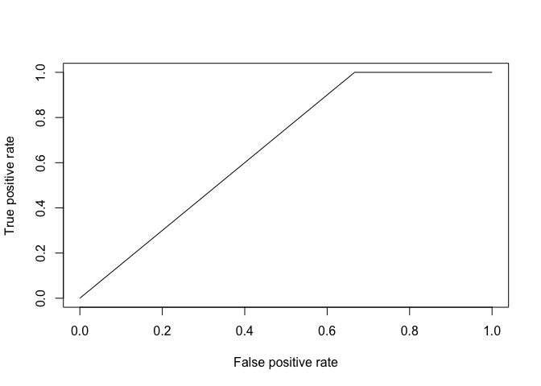
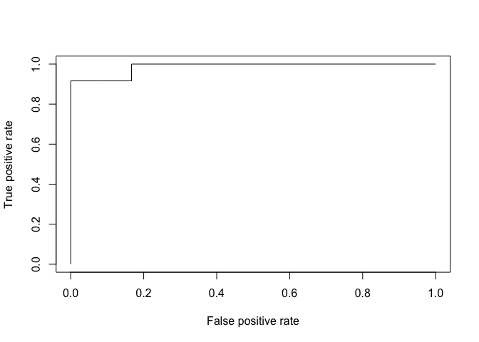
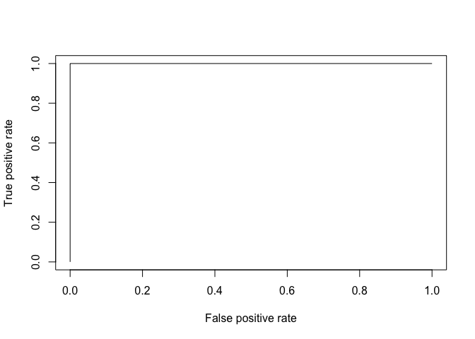

get & prep data

    data <- read.csv('../data/CPP_data_all.csv', header=TRUE)
    library(plyr)
    data <- ddply(data, .(URSI, SM_dx), summarize,
                  Turn_Count=sum(Turn_Count),
                  Child_Voc_Count=sum(Child_Voc_Count),
                  Child_Voc_Duration=sum(Child_Voc_Duration),
                  Child_NonVoc_Duration=sum(Child_NonVoc_Duration),
                  Average_SignalLevel=mean(Average_SignalLevel),
                  Peak_SignalLevel=max(Peak_SignalLevel)
                  )
    data <- data[,2:8]
    data$SM_dx <- factor(data$SM_dx)

subset train/test

    set.seed(2)
    train_ind <- sample(seq_len(nrow(data)), size=19)

    train <- data[train_ind, ]
    test <- data[-train_ind, ]

Logistical regression predicting SM dx

    overfit.model <- glm(SM_dx ~ ., family=binomial(link='logit'), data=data)

    ## Warning: glm.fit: fitted probabilities numerically 0 or 1 occurred

    summary(overfit.model)

    ## 
    ## Call:
    ## glm(formula = SM_dx ~ ., family = binomial(link = "logit"), data = data)
    ## 
    ## Deviance Residuals: 
    ##      Min        1Q    Median        3Q       Max  
    ## -1.31463  -0.15227  -0.00001   0.00958   1.88559  
    ## 
    ## Coefficients:
    ##                        Estimate Std. Error z value Pr(>|z|)
    ## (Intercept)            27.68975  130.87658   0.212    0.832
    ## Turn_Count              0.08218    0.10353   0.794    0.427
    ## Child_Voc_Count        -0.34036    0.27246  -1.249    0.212
    ## Child_Voc_Duration      0.29761    0.25499   1.167    0.243
    ## Child_NonVoc_Duration   0.01192    0.21905   0.054    0.957
    ## Average_SignalLevel     3.44383    2.42805   1.418    0.156
    ## Peak_SignalLevel       -2.86856    2.63568  -1.088    0.276
    ## 
    ## (Dispersion parameter for binomial family taken to be 1)
    ## 
    ##     Null deviance: 33.271  on 23  degrees of freedom
    ## Residual deviance:  6.929  on 17  degrees of freedom
    ## AIC: 20.929
    ## 
    ## Number of Fisher Scoring iterations: 9

    anova(overfit.model, test="Chisq")

    ## Analysis of Deviance Table
    ## 
    ## Model: binomial, link: logit
    ## 
    ## Response: SM_dx
    ## 
    ## Terms added sequentially (first to last)
    ## 
    ## 
    ##                       Df Deviance Resid. Df Resid. Dev Pr(>Chi)   
    ## NULL                                     23     33.271            
    ## Turn_Count             1   8.0389        22     25.232 0.004578 **
    ## Child_Voc_Count        1   0.9950        21     24.237 0.318527   
    ## Child_Voc_Duration     1   7.5150        20     16.722 0.006119 **
    ## Child_NonVoc_Duration  1   1.8870        19     14.835 0.169544   
    ## Average_SignalLevel    1   5.6737        18      9.162 0.017221 * 
    ## Peak_SignalLevel       1   2.2326        17      6.929 0.135127   
    ## ---
    ## Signif. codes:  0 '***' 0.001 '**' 0.01 '*' 0.05 '.' 0.1 ' ' 1

ROC for logistical regression

    library('ROCR')

    ## Loading required package: gplots

    ## 
    ## Attaching package: 'gplots'

    ## The following object is masked from 'package:stats':
    ## 
    ##     lowess

    overfit.p <- predict(overfit.model, newdata=data, type="response")
    overfit.pr <- prediction(overfit.p, data$SM_dx)
    overfit.prf <- performance(overfit.pr, measure="tpr", x.measure="fpr")
    plot(overfit.prf)

AUC for ROC

    overfit.auc <- performance(overfit.pr, measure="auc")
    overfit.auc <- overfit.auc@y.values[[1]]
    overfit.auc

    ## [1] 0.9861111

Logistical regression predicting SM dx

    model <- glm(SM_dx ~ ., family=binomial(link='logit'), data=train)

    ## Warning: glm.fit: algorithm did not converge

    ## Warning: glm.fit: fitted probabilities numerically 0 or 1 occurred

    summary(model)

    ## 
    ## Call:
    ## glm(formula = SM_dx ~ ., family = binomial(link = "logit"), data = train)
    ## 
    ## Deviance Residuals: 
    ##        Min          1Q      Median          3Q         Max  
    ## -7.069e-05  -2.100e-08   2.100e-08   2.100e-08   7.666e-05  
    ## 
    ## Coefficients:
    ##                         Estimate Std. Error z value Pr(>|z|)
    ## (Intercept)              9365.13 3498867.55   0.003    0.998
    ## Turn_Count                 13.67    4763.53   0.003    0.998
    ## Child_Voc_Count           -31.77   11005.62  -0.003    0.998
    ## Child_Voc_Duration         30.76   10676.82   0.003    0.998
    ## Child_NonVoc_Duration      23.28    8568.59   0.003    0.998
    ## Average_SignalLevel        31.11   12815.23   0.002    0.998
    ## Peak_SignalLevel         -132.80   48024.30  -0.003    0.998
    ## 
    ## (Dispersion parameter for binomial family taken to be 1)
    ## 
    ##     Null deviance: 2.6287e+01  on 18  degrees of freedom
    ## Residual deviance: 1.6644e-08  on 12  degrees of freedom
    ## AIC: 14
    ## 
    ## Number of Fisher Scoring iterations: 25

    anova(model, test="Chisq")

    ## Analysis of Deviance Table
    ## 
    ## Model: binomial, link: logit
    ## 
    ## Response: SM_dx
    ## 
    ## Terms added sequentially (first to last)
    ## 
    ## 
    ##                       Df Deviance Resid. Df Resid. Dev Pr(>Chi)   
    ## NULL                                     18    26.2869            
    ## Turn_Count             1   5.3282        17    20.9587 0.020983 * 
    ## Child_Voc_Count        1   1.2313        16    19.7274 0.267152   
    ## Child_Voc_Duration     1   7.1420        15    12.5854 0.007530 **
    ## Child_NonVoc_Duration  1   1.3874        14    11.1980 0.238847   
    ## Average_SignalLevel    1   4.0002        13     7.1978 0.045494 * 
    ## Peak_SignalLevel       1   7.1978        12     0.0000 0.007299 **
    ## ---
    ## Signif. codes:  0 '***' 0.001 '**' 0.01 '*' 0.05 '.' 0.1 ' ' 1

    p <- predict(model, newdata=test, type="response")
    pr <- prediction(p, test$SM_dx)
    prf <- performance(pr, measure="tpr", x.measure="fpr")
    plot(prf)

    auc <- performance(pr, measure="auc")
    auc <- auc@y.values[[1]]
    auc

    ## [1] 0.6666667

forward logistical regression

    library("MASS")
    fwd.overfit.model <- stepAIC(glm(SM_dx ~ Child_Voc_Count, family=binomial(link='logit'), data=data), direction='forward',
                         scope=~Child_Voc_Count+Turn_Count+Child_Voc_Duration+Child_NonVoc_Duration+Average_SignalLevel+Peak_SignalLevel)

    ## Start:  AIC=28.24
    ## SM_dx ~ Child_Voc_Count
    ## 
    ##                         Df Deviance    AIC
    ## + Child_Voc_Duration     1   17.887 23.887
    ## + Average_SignalLevel    1   18.588 24.588
    ## <none>                       24.238 28.238
    ## + Peak_SignalLevel       1   23.779 29.779
    ## + Child_NonVoc_Duration  1   24.172 30.172
    ## + Turn_Count             1   24.237 30.237
    ## 
    ## Step:  AIC=23.89
    ## SM_dx ~ Child_Voc_Count + Child_Voc_Duration
    ## 
    ##                         Df Deviance    AIC
    ## + Average_SignalLevel    1   9.2246 17.225
    ## + Child_NonVoc_Duration  1  15.7369 23.737
    ## <none>                      17.8870 23.887
    ## + Turn_Count             1  16.7222 24.722
    ## + Peak_SignalLevel       1  17.8614 25.861
    ## 
    ## Step:  AIC=17.22
    ## SM_dx ~ Child_Voc_Count + Child_Voc_Duration + Average_SignalLevel
    ## 
    ##                         Df Deviance    AIC
    ## <none>                       9.2246 17.225
    ## + Peak_SignalLevel       1   7.8506 17.851
    ## + Child_NonVoc_Duration  1   9.1616 19.162
    ## + Turn_Count             1   9.2213 19.221

    fwd.overfit.model$anova

    ## Stepwise Model Path 
    ## Analysis of Deviance Table
    ## 
    ## Initial Model:
    ## SM_dx ~ Child_Voc_Count
    ## 
    ## Final Model:
    ## SM_dx ~ Child_Voc_Count + Child_Voc_Duration + Average_SignalLevel
    ## 
    ## 
    ##                    Step Df Deviance Resid. Df Resid. Dev      AIC
    ## 1                                          22  24.237946 28.23795
    ## 2  + Child_Voc_Duration  1 6.350912        21  17.887033 23.88703
    ## 3 + Average_SignalLevel  1 8.662386        20   9.224648 17.22465

ROC, AUC

    fwd.overfit.p <- predict(fwd.overfit.model, newdata=data, type="response")
    fwd.overfit.pr <- prediction(fwd.overfit.p, data$SM_dx)
    fwd.overfit.prf <- performance(fwd.overfit.pr, measure="tpr", x.measure="fpr")
    plot(fwd.overfit.prf)

    fwd.overfit.auc <- performance(fwd.overfit.pr, measure="auc")
    fwd.overfit.auc <- fwd.overfit.auc@y.values[[1]]
    fwd.overfit.auc

    ## [1] 0.9861111

forward logistical regression without overfitting

    fwd.model <- stepAIC(glm(SM_dx ~ Child_Voc_Count, family=binomial(link='logit'), data=train), direction='forward', scope=~Child_Voc_Count+Turn_Count+Child_Voc_Duration+Child_NonVoc_Duration+Average_SignalLevel+Peak_SignalLevel)

    ## Start:  AIC=23.77
    ## SM_dx ~ Child_Voc_Count
    ## 
    ##                         Df Deviance    AIC
    ## + Child_Voc_Duration     1   14.194 20.194
    ## + Average_SignalLevel    1   16.105 22.105
    ## <none>                       19.765 23.765
    ## + Peak_SignalLevel       1   19.569 25.569
    ## + Child_NonVoc_Duration  1   19.593 25.593
    ## + Turn_Count             1   19.727 25.727
    ## 
    ## Step:  AIC=20.19
    ## SM_dx ~ Child_Voc_Count + Child_Voc_Duration
    ## 
    ##                         Df Deviance    AIC
    ## + Average_SignalLevel    1   7.6476 15.648
    ## <none>                      14.1936 20.194
    ## + Turn_Count             1  12.5854 20.585
    ## + Child_NonVoc_Duration  1  13.2794 21.279
    ## + Peak_SignalLevel       1  14.1165 22.116
    ## 
    ## Step:  AIC=15.65
    ## SM_dx ~ Child_Voc_Count + Child_Voc_Duration + Average_SignalLevel
    ## 
    ##                         Df Deviance    AIC
    ## <none>                       7.6476 15.648
    ## + Peak_SignalLevel       1   6.9896 16.990
    ## + Turn_Count             1   7.3164 17.316
    ## + Child_NonVoc_Duration  1   7.4197 17.420

    fwd.model$anova

    ## Stepwise Model Path 
    ## Analysis of Deviance Table
    ## 
    ## Initial Model:
    ## SM_dx ~ Child_Voc_Count
    ## 
    ## Final Model:
    ## SM_dx ~ Child_Voc_Count + Child_Voc_Duration + Average_SignalLevel
    ## 
    ## 
    ##                    Step Df Deviance Resid. Df Resid. Dev      AIC
    ## 1                                          17  19.765295 23.76529
    ## 2  + Child_Voc_Duration  1  5.57168        16  14.193615 20.19362
    ## 3 + Average_SignalLevel  1  6.54597        15   7.647645 15.64765

    fwd.p <- predict(fwd.model, newdata=test, type="response")
    fwd.pr <- prediction(fwd.p, test$SM_dx)
    fwd.prf <- performance(fwd.pr, measure="tpr", x.measure="fpr")
    plot(fwd.prf)

    fwd.auc <- performance(fwd.pr, measure="auc")
    fwd.auc <- fwd.auc@y.values[[1]]
    fwd.auc

    ## [1] 1
