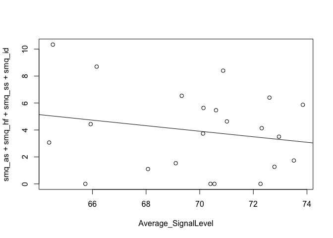

get & prep data

    library(car)
    library(MASS)
    library(MESS)

    ## Loading required package: geepack

    ## Loading required package: geeM

    ## Loading required package: Matrix

    library(plyr)
    library(ROCR)

    ## Loading required package: gplots

    ## 
    ## Attaching package: 'gplots'

    ## The following object is masked from 'package:stats':
    ## 
    ##     lowess

    data <- read.csv('../data/CPP_data_all.csv', header=TRUE)
    smq <- read.csv('../data/SMQ.csv', header=TRUE)
    smq$smq_id <- (18 - smq$smq_id) / 6
    data <- ddply(data, .(URSI, SM_dx), summarize,
                  Turn_Count=sum(Turn_Count),
                  Child_Voc_Count=sum(Child_Voc_Count),
                  Child_Voc_Duration=sum(Child_Voc_Duration),
                  Child_NonVoc_Duration=sum(Child_NonVoc_Duration),
                  Average_SignalLevel=mean(Average_SignalLevel),
                  Peak_SignalLevel=max(Peak_SignalLevel)
                  )
    data <- merge(data, smq, by="URSI", all=TRUE)
    remove(smq)
    # invert SMQ for severity
    data$smq_as <- 3 - data$smq_as
    data$smq_hf <- 3 - data$smq_hf
    data$smq_ss <- 3 - data$smq_ss
    data$smq_id <- 3 - data$smq_id
    data$SM_dx <- factor(data$SM_dx)
    smq_data <- data[complete.cases(data),]

logistical regression predicting SM dx

    lreg_fp <- vector()
    lreg_tp <- vector()
    #lreg_predictions <- vector()
    #lreg_labels <- vector()
    for(i in 1:nrow(data)){
      train <- data[-i,]
      test <- data[i,]
      lreg_model <- glm(SM_dx~Child_Voc_Count+Turn_Count+Child_Voc_Duration+Child_NonVoc_Duration+
                    Average_SignalLevel+Peak_SignalLevel, family=binomial(link='logit'), data=train,
                    na.action=na.pass)
      lreg_p <- predict(lreg_model, test, "response")
      lreg_pr <- prediction(lreg_p, test$SM_dx)
      #lreg_predictions <- c(lreg_predictions, lreg_pr@predictions)
      #lreg_labels <- c(lreg_labels, lreg_pr@labels)
      lreg_fp <- c(lreg_fp, lreg_pr@fp[[1]][[2]])
      lreg_tp <- c(lreg_tp, lreg_pr@tp[[1]][[2]])
      #summary(lreg_model)
      #anova(lreg_model, test="Chisq")
      remove(train)
      remove(test)
    }

    ## Warning: glm.fit: algorithm did not converge

    ## Warning: glm.fit: fitted probabilities numerically 0 or 1 occurred

    ## Warning: glm.fit: fitted probabilities numerically 0 or 1 occurred

    ## Warning: glm.fit: fitted probabilities numerically 0 or 1 occurred

    ## Warning: glm.fit: fitted probabilities numerically 0 or 1 occurred

    ## Warning: glm.fit: fitted probabilities numerically 0 or 1 occurred

    ## Warning: glm.fit: fitted probabilities numerically 0 or 1 occurred

    ## Warning: glm.fit: fitted probabilities numerically 0 or 1 occurred

    ## Warning: glm.fit: fitted probabilities numerically 0 or 1 occurred

    ## Warning: glm.fit: fitted probabilities numerically 0 or 1 occurred

    ## Warning: glm.fit: fitted probabilities numerically 0 or 1 occurred

    ## Warning: glm.fit: fitted probabilities numerically 0 or 1 occurred

    ## Warning: glm.fit: fitted probabilities numerically 0 or 1 occurred

    ## Warning: glm.fit: fitted probabilities numerically 0 or 1 occurred

    ## Warning: glm.fit: algorithm did not converge

    ## Warning: glm.fit: fitted probabilities numerically 0 or 1 occurred

    ## Warning: glm.fit: algorithm did not converge

    ## Warning: glm.fit: fitted probabilities numerically 0 or 1 occurred

    ## Warning: glm.fit: fitted probabilities numerically 0 or 1 occurred

    ## Warning: glm.fit: fitted probabilities numerically 0 or 1 occurred

    ## Warning: glm.fit: fitted probabilities numerically 0 or 1 occurred

    ## Warning: glm.fit: fitted probabilities numerically 0 or 1 occurred

    ## Warning: glm.fit: fitted probabilities numerically 0 or 1 occurred

    ## Warning: glm.fit: algorithm did not converge

    ## Warning: glm.fit: fitted probabilities numerically 0 or 1 occurred

    remove(i)
    lreg_model <- glm(SM_dx~Child_Voc_Count+Turn_Count+Child_Voc_Duration+Child_NonVoc_Duration+
                  Average_SignalLevel+Peak_SignalLevel, family=binomial(link='logit'), data=data)

    ## Warning: glm.fit: fitted probabilities numerically 0 or 1 occurred

    print(summary(lreg_model))

    ## 
    ## Call:
    ## glm(formula = SM_dx ~ Child_Voc_Count + Turn_Count + Child_Voc_Duration + 
    ##     Child_NonVoc_Duration + Average_SignalLevel + Peak_SignalLevel, 
    ##     family = binomial(link = "logit"), data = data)
    ## 
    ## Deviance Residuals: 
    ##      Min        1Q    Median        3Q       Max  
    ## -1.31463  -0.15227  -0.00001   0.00958   1.88559  
    ## 
    ## Coefficients:
    ##                        Estimate Std. Error z value Pr(>|z|)
    ## (Intercept)            27.68975  130.87658   0.212    0.832
    ## Child_Voc_Count        -0.34036    0.27246  -1.249    0.212
    ## Turn_Count              0.08218    0.10353   0.794    0.427
    ## Child_Voc_Duration      0.29761    0.25499   1.167    0.243
    ## Child_NonVoc_Duration   0.01192    0.21905   0.054    0.957
    ## Average_SignalLevel     3.44383    2.42805   1.418    0.156
    ## Peak_SignalLevel       -2.86856    2.63568  -1.088    0.276
    ## 
    ## (Dispersion parameter for binomial family taken to be 1)
    ## 
    ##     Null deviance: 33.271  on 23  degrees of freedom
    ## Residual deviance:  6.929  on 17  degrees of freedom
    ## AIC: 20.929
    ## 
    ## Number of Fisher Scoring iterations: 9

    print(anova(lreg_model, test="Chisq"))

    ## Analysis of Deviance Table
    ## 
    ## Model: binomial, link: logit
    ## 
    ## Response: SM_dx
    ## 
    ## Terms added sequentially (first to last)
    ## 
    ## 
    ##                       Df Deviance Resid. Df Resid. Dev Pr(>Chi)   
    ## NULL                                     23     33.271            
    ## Child_Voc_Count        1   9.0331        22     24.238 0.002651 **
    ## Turn_Count             1   0.0007        21     24.237 0.978189   
    ## Child_Voc_Duration     1   7.5150        20     16.722 0.006119 **
    ## Child_NonVoc_Duration  1   1.8870        19     14.835 0.169544   
    ## Average_SignalLevel    1   5.6737        18      9.162 0.017221 * 
    ## Peak_SignalLevel       1   2.2326        17      6.929 0.135127   
    ## ---
    ## Signif. codes:  0 '***' 0.001 '**' 0.01 '*' 0.05 '.' 0.1 ' ' 1

    par(pty="s")
    plot(c(0,cumsum(lreg_fp)/sum(lreg_fp),1), c(0,cumsum(lreg_tp)/sum(lreg_tp),1), type='l', xlab=
         "False positive rate", ylab="True positive rate", xlim=c(0,1), ylim=c(0,1), asp=1)
    text(0.6, 0.2, labels=paste("auc: ", auc(cumsum(lreg_fp)/sum(lreg_fp), cumsum(lreg_tp)/sum(lreg_tp))))

logistical forward regression predicting SM dx

    lfreg_fp <- vector()
    lfreg_tp <- vector()
    #lreg_predictions <- vector()
    #lreg_labels <- vector()
    for(i in 1:nrow(data)){
      train <- data[-i,]
      test <- data[i,]
      lfreg_model <- stepAIC(glm(SM_dx ~ 1, family=binomial(link='logit'), data=train, na.action=na.pass),
                    direction='forward', scope=~Child_Voc_Count+Turn_Count+Child_Voc_Duration+
                    Child_NonVoc_Duration+Average_SignalLevel+Peak_SignalLevel)
      lfreg_p <- predict(lfreg_model, test, "response")
      lfreg_pr <- prediction(lfreg_p, test$SM_dx)
      #lreg_predictions <- c(lreg_predictions, lreg_pr@predictions)
      #lreg_labels <- c(lreg_labels, lreg_pr@labels)
      lfreg_fp <- c(lfreg_fp, lfreg_pr@fp[[1]][[2]])
      lfreg_tp <- c(lfreg_tp, lfreg_pr@tp[[1]][[2]])
      #summary(lreg_model)
      #anova(lreg_model, test="Chisq")
      remove(train)
      remove(test)
    }

    ## Start:  AIC=33.84
    ## SM_dx ~ 1
    ## 
    ##                         Df Deviance    AIC
    ## + Child_Voc_Count        1   23.880 27.880
    ## + Turn_Count             1   25.053 29.053
    ## + Child_Voc_Duration     1   25.714 29.714
    ## + Child_NonVoc_Duration  1   28.398 32.398
    ## <none>                       31.841 33.841
    ## + Peak_SignalLevel       1   31.655 35.655
    ## + Average_SignalLevel    1   31.702 35.702
    ## 
    ## Step:  AIC=27.88
    ## SM_dx ~ Child_Voc_Count
    ## 
    ##                         Df Deviance    AIC
    ## + Child_Voc_Duration     1   17.759 23.759
    ## + Average_SignalLevel    1   18.110 24.110
    ## <none>                       23.880 27.880
    ## + Peak_SignalLevel       1   23.315 29.315
    ## + Turn_Count             1   23.832 29.832
    ## + Child_NonVoc_Duration  1   23.877 29.877
    ## 
    ## Step:  AIC=23.76
    ## SM_dx ~ Child_Voc_Count + Child_Voc_Duration
    ## 
    ##                         Df Deviance    AIC
    ## + Average_SignalLevel    1   9.0712 17.071
    ## + Child_NonVoc_Duration  1  14.9943 22.994
    ## <none>                      17.7593 23.759
    ## + Turn_Count             1  16.2140 24.214
    ## + Peak_SignalLevel       1  17.7215 25.721
    ## 
    ## Step:  AIC=17.07
    ## SM_dx ~ Child_Voc_Count + Child_Voc_Duration + Average_SignalLevel
    ## 
    ##                         Df Deviance    AIC
    ## <none>                       9.0712 17.071
    ## + Peak_SignalLevel       1   7.8244 17.824
    ## + Child_NonVoc_Duration  1   8.7421 18.742
    ## + Turn_Count             1   9.0085 19.009
    ## Start:  AIC=33.84
    ## SM_dx ~ 1
    ## 
    ##                         Df Deviance    AIC
    ## + Child_Voc_Count        1   23.975 27.975
    ## + Turn_Count             1   24.999 28.999
    ## + Child_Voc_Duration     1   25.826 29.826
    ## + Child_NonVoc_Duration  1   28.070 32.070
    ## <none>                       31.841 33.841
    ## + Peak_SignalLevel       1   31.605 35.605
    ## + Average_SignalLevel    1   31.798 35.798
    ## 
    ## Step:  AIC=27.98
    ## SM_dx ~ Child_Voc_Count
    ## 
    ##                         Df Deviance    AIC
    ## + Child_Voc_Duration     1   17.800 23.800
    ## + Average_SignalLevel    1   17.815 23.815
    ## <none>                       23.975 27.975
    ## + Peak_SignalLevel       1   23.481 29.481
    ## + Child_NonVoc_Duration  1   23.930 29.930
    ## + Turn_Count             1   23.969 29.969
    ## 
    ## Step:  AIC=23.8
    ## SM_dx ~ Child_Voc_Count + Child_Voc_Duration
    ## 
    ##                         Df Deviance    AIC
    ## + Average_SignalLevel    1   9.0566 17.057
    ## + Child_NonVoc_Duration  1  15.6686 23.669
    ## <none>                      17.8003 23.800
    ## + Turn_Count             1  16.6123 24.612
    ## + Peak_SignalLevel       1  17.7692 25.769
    ## 
    ## Step:  AIC=17.06
    ## SM_dx ~ Child_Voc_Count + Child_Voc_Duration + Average_SignalLevel
    ## 
    ##                         Df Deviance    AIC
    ## <none>                       9.0566 17.057
    ## + Peak_SignalLevel       1   7.7160 17.716
    ## + Child_NonVoc_Duration  1   8.9649 18.965
    ## + Turn_Count             1   9.0532 19.053
    ## Start:  AIC=33.84
    ## SM_dx ~ 1
    ## 
    ##                         Df Deviance    AIC
    ## + Child_Voc_Count        1   23.402 27.402
    ## + Turn_Count             1   24.468 28.468
    ## + Child_Voc_Duration     1   25.217 29.217
    ## + Child_NonVoc_Duration  1   27.821 31.821
    ## <none>                       31.841 33.841
    ## + Peak_SignalLevel       1   30.818 34.818
    ## + Average_SignalLevel    1   31.368 35.368
    ## 
    ## Step:  AIC=27.4
    ## SM_dx ~ Child_Voc_Count
    ## 
    ##                         Df Deviance    AIC
    ## + Child_Voc_Duration     1   17.589 23.589
    ## + Average_SignalLevel    1   18.490 24.490
    ## <none>                       23.402 27.402
    ## + Peak_SignalLevel       1   23.217 29.217
    ## + Turn_Count             1   23.388 29.388
    ## + Child_NonVoc_Duration  1   23.389 29.389
    ## 
    ## Step:  AIC=23.59
    ## SM_dx ~ Child_Voc_Count + Child_Voc_Duration
    ## 
    ##                         Df Deviance    AIC
    ## + Average_SignalLevel    1   9.2237 17.224
    ## + Child_NonVoc_Duration  1  15.3285 23.328
    ## <none>                      17.5887 23.589
    ## + Turn_Count             1  16.4572 24.457
    ## + Peak_SignalLevel       1  17.5866 25.587
    ## 
    ## Step:  AIC=17.22
    ## SM_dx ~ Child_Voc_Count + Child_Voc_Duration + Average_SignalLevel
    ## 
    ##                         Df Deviance    AIC
    ## <none>                       9.2237 17.224
    ## + Peak_SignalLevel       1   7.8501 17.850
    ## + Child_NonVoc_Duration  1   9.1602 19.160
    ## + Turn_Count             1   9.2203 19.220
    ## Start:  AIC=33.84
    ## SM_dx ~ 1
    ## 
    ##                         Df Deviance    AIC
    ## + Child_Voc_Count        1   23.148 27.148
    ## + Turn_Count             1   23.517 27.517
    ## + Child_Voc_Duration     1   25.008 29.008
    ## + Child_NonVoc_Duration  1   27.590 31.590
    ## <none>                       31.841 33.841
    ## + Average_SignalLevel    1   31.454 35.454
    ## + Peak_SignalLevel       1   31.517 35.517
    ## 
    ## Step:  AIC=27.15
    ## SM_dx ~ Child_Voc_Count
    ## 
    ##                         Df Deviance    AIC
    ## + Child_Voc_Duration     1   17.324 23.324
    ## + Average_SignalLevel    1   18.139 24.139
    ## <none>                       23.148 27.148
    ## + Peak_SignalLevel       1   22.515 28.515
    ## + Turn_Count             1   23.079 29.079
    ## + Child_NonVoc_Duration  1   23.128 29.128
    ## 
    ## Step:  AIC=23.32
    ## SM_dx ~ Child_Voc_Count + Child_Voc_Duration
    ## 
    ##                         Df Deviance    AIC
    ## + Average_SignalLevel    1   9.1962 17.196
    ## + Child_NonVoc_Duration  1  14.9442 22.944
    ## <none>                      17.3244 23.324
    ## + Turn_Count             1  16.5513 24.551
    ## + Peak_SignalLevel       1  17.2582 25.258
    ## 
    ## Step:  AIC=17.2
    ## SM_dx ~ Child_Voc_Count + Child_Voc_Duration + Average_SignalLevel
    ## 
    ##                         Df Deviance    AIC
    ## <none>                       9.1962 17.196
    ## + Peak_SignalLevel       1   7.8491 17.849
    ## + Child_NonVoc_Duration  1   9.1252 19.125
    ## + Turn_Count             1   9.1953 19.195
    ## Start:  AIC=33.84
    ## SM_dx ~ 1
    ## 
    ##                         Df Deviance    AIC
    ## + Child_Voc_Count        1   23.734 27.734
    ## + Turn_Count             1   24.646 28.646
    ## + Child_Voc_Duration     1   25.587 29.587
    ## + Child_NonVoc_Duration  1   27.322 31.322
    ## <none>                       31.841 33.841
    ## + Peak_SignalLevel       1   31.308 35.308
    ## + Average_SignalLevel    1   31.522 35.522
    ## 
    ## Step:  AIC=27.73
    ## SM_dx ~ Child_Voc_Count
    ## 
    ##                         Df Deviance    AIC
    ## + Child_Voc_Duration     1   17.582 23.582
    ## + Average_SignalLevel    1   18.509 24.509
    ## <none>                       23.734 27.734
    ## + Peak_SignalLevel       1   23.360 29.360
    ## + Child_NonVoc_Duration  1   23.639 29.639
    ## + Turn_Count             1   23.733 29.733
    ## 
    ## Step:  AIC=23.58
    ## SM_dx ~ Child_Voc_Count + Child_Voc_Duration
    ## 
    ##                         Df Deviance    AIC
    ## + Average_SignalLevel    1   9.2218 17.222
    ## <none>                      17.5817 23.582
    ## + Child_NonVoc_Duration  1  15.6300 23.630
    ## + Turn_Count             1  16.4741 24.474
    ## + Peak_SignalLevel       1  17.5665 25.567
    ## 
    ## Step:  AIC=17.22
    ## SM_dx ~ Child_Voc_Count + Child_Voc_Duration + Average_SignalLevel
    ## 
    ##                         Df Deviance    AIC
    ## <none>                       9.2218 17.222
    ## + Peak_SignalLevel       1   7.8503 17.850
    ## + Child_NonVoc_Duration  1   9.1589 19.159
    ## + Turn_Count             1   9.2185 19.218
    ## Start:  AIC=33.84
    ## SM_dx ~ 1
    ## 
    ##                         Df Deviance    AIC
    ## + Child_Voc_Count        1   23.678 27.678
    ## + Turn_Count             1   24.673 28.673
    ## + Child_Voc_Duration     1   25.541 29.541
    ## + Child_NonVoc_Duration  1   27.617 31.617
    ## <none>                       31.841 33.841
    ## + Peak_SignalLevel       1   31.609 35.609
    ## + Average_SignalLevel    1   31.732 35.732
    ## 
    ## Step:  AIC=27.68
    ## SM_dx ~ Child_Voc_Count
    ## 
    ##                         Df Deviance    AIC
    ## + Average_SignalLevel    1   17.229 23.229
    ## + Child_Voc_Duration     1   17.486 23.486
    ## <none>                       23.678 27.678
    ## + Peak_SignalLevel       1   23.077 29.077
    ## + Child_NonVoc_Duration  1   23.620 29.620
    ## + Turn_Count             1   23.673 29.673
    ## 
    ## Step:  AIC=23.23
    ## SM_dx ~ Child_Voc_Count + Average_SignalLevel
    ## 
    ##                         Df Deviance    AIC
    ## + Child_Voc_Duration     1   8.0978 16.098
    ## <none>                      17.2286 23.229
    ## + Child_NonVoc_Duration  1  16.3923 24.392
    ## + Turn_Count             1  16.7821 24.782
    ## + Peak_SignalLevel       1  17.2284 25.228
    ## 
    ## Step:  AIC=16.1
    ## SM_dx ~ Child_Voc_Count + Average_SignalLevel + Child_Voc_Duration
    ## 
    ##                         Df Deviance    AIC
    ## <none>                       8.0978 16.098
    ## + Peak_SignalLevel       1   7.1100 17.110
    ## + Child_NonVoc_Duration  1   8.0130 18.013
    ## + Turn_Count             1   8.0971 18.097
    ## Start:  AIC=33.84
    ## SM_dx ~ 1
    ## 
    ##                         Df Deviance    AIC
    ## + Child_Voc_Count        1   20.884 24.884
    ## + Turn_Count             1   21.732 25.732
    ## + Child_Voc_Duration     1   23.191 27.191
    ## + Child_NonVoc_Duration  1   25.526 29.526
    ## <none>                       31.841 33.841
    ## + Average_SignalLevel    1   30.523 34.523
    ## + Peak_SignalLevel       1   30.732 34.732
    ## 
    ## Step:  AIC=24.88
    ## SM_dx ~ Child_Voc_Count
    ## 
    ##                         Df Deviance    AIC
    ## + Child_Voc_Duration     1   14.807 20.807
    ## + Average_SignalLevel    1   17.914 23.914
    ## <none>                       20.884 24.884
    ## + Child_NonVoc_Duration  1   20.525 26.525
    ## + Turn_Count             1   20.845 26.845
    ## + Peak_SignalLevel       1   20.849 26.849
    ## 
    ## Step:  AIC=20.81
    ## SM_dx ~ Child_Voc_Count + Child_Voc_Duration
    ## 
    ##                         Df Deviance    AIC
    ## + Average_SignalLevel    1   9.1152 17.115
    ## <none>                      14.8069 20.807
    ## + Child_NonVoc_Duration  1  14.0901 22.090
    ## + Turn_Count             1  14.2999 22.300
    ## + Peak_SignalLevel       1  14.5862 22.586
    ## 
    ## Step:  AIC=17.12
    ## SM_dx ~ Child_Voc_Count + Child_Voc_Duration + Average_SignalLevel
    ## 
    ##                         Df Deviance    AIC
    ## <none>                       9.1152 17.115
    ## + Peak_SignalLevel       1   7.7963 17.796
    ## + Child_NonVoc_Duration  1   9.0701 19.070
    ## + Turn_Count             1   9.1127 19.113
    ## Start:  AIC=33.84
    ## SM_dx ~ 1
    ## 
    ##                         Df Deviance    AIC
    ## + Child_Voc_Count        1   23.551 27.551
    ## + Turn_Count             1   24.419 28.419
    ## + Child_Voc_Duration     1   25.293 29.293
    ## + Child_NonVoc_Duration  1   26.867 30.867
    ## <none>                       31.841 33.841
    ## + Peak_SignalLevel       1   31.646 35.646
    ## + Average_SignalLevel    1   31.664 35.664
    ## 
    ## Step:  AIC=27.55
    ## SM_dx ~ Child_Voc_Count
    ## 
    ##                         Df Deviance    AIC
    ## + Average_SignalLevel    1   16.993 22.993
    ## + Child_Voc_Duration     1   17.797 23.797
    ## <none>                       23.551 27.551
    ## + Peak_SignalLevel       1   22.832 28.832
    ## + Child_NonVoc_Duration  1   23.395 29.395
    ## + Turn_Count             1   23.550 29.550
    ## 
    ## Step:  AIC=22.99
    ## SM_dx ~ Child_Voc_Count + Average_SignalLevel
    ## 
    ##                         Df Deviance    AIC
    ## + Child_Voc_Duration     1   8.9638 16.964
    ## <none>                      16.9928 22.993
    ## + Child_NonVoc_Duration  1  15.1950 23.195
    ## + Turn_Count             1  16.0193 24.019
    ## + Peak_SignalLevel       1  16.9654 24.965
    ## 
    ## Step:  AIC=16.96
    ## SM_dx ~ Child_Voc_Count + Average_SignalLevel + Child_Voc_Duration
    ## 
    ##                         Df Deviance    AIC
    ## <none>                       8.9638 16.964
    ## + Peak_SignalLevel       1   7.7823 17.782
    ## + Turn_Count             1   8.9569 18.957
    ## + Child_NonVoc_Duration  1   8.9636 18.964
    ## Start:  AIC=33.84
    ## SM_dx ~ 1
    ## 
    ##                         Df Deviance    AIC
    ## + Child_Voc_Count        1   23.899 27.899
    ## + Turn_Count             1   24.849 28.849
    ## + Child_Voc_Duration     1   25.765 29.765
    ## + Child_NonVoc_Duration  1   27.900 31.900
    ## <none>                       31.841 33.841
    ## + Peak_SignalLevel       1   31.377 35.377
    ## + Average_SignalLevel    1   31.547 35.547
    ## 
    ## Step:  AIC=27.9
    ## SM_dx ~ Child_Voc_Count
    ## 
    ##                         Df Deviance    AIC
    ## + Child_Voc_Duration     1   17.662 23.662
    ## + Average_SignalLevel    1   18.556 24.556
    ## <none>                       23.899 27.899
    ## + Peak_SignalLevel       1   23.494 29.494
    ## + Child_NonVoc_Duration  1   23.849 29.849
    ## + Turn_Count             1   23.898 29.898
    ## 
    ## Step:  AIC=23.66
    ## SM_dx ~ Child_Voc_Count + Child_Voc_Duration
    ## 
    ##                         Df Deviance    AIC
    ## + Average_SignalLevel    1   9.2238 17.224
    ## + Child_NonVoc_Duration  1  15.5055 23.506
    ## <none>                      17.6624 23.662
    ## + Turn_Count             1  16.4968 24.497
    ## + Peak_SignalLevel       1  17.6432 25.643
    ## 
    ## Step:  AIC=17.22
    ## SM_dx ~ Child_Voc_Count + Child_Voc_Duration + Average_SignalLevel
    ## 
    ##                         Df Deviance    AIC
    ## <none>                       9.2238 17.224
    ## + Peak_SignalLevel       1   7.8506 17.851
    ## + Child_NonVoc_Duration  1   9.1605 19.160
    ## + Turn_Count             1   9.2204 19.220
    ## Start:  AIC=33.84
    ## SM_dx ~ 1
    ## 
    ##                         Df Deviance    AIC
    ## + Child_Voc_Count        1   22.902 26.902
    ## + Turn_Count             1   23.670 27.670
    ## + Child_NonVoc_Duration  1   24.187 28.187
    ## + Child_Voc_Duration     1   24.965 28.965
    ## <none>                       31.841 33.841
    ## + Average_SignalLevel    1   31.133 35.133
    ## + Peak_SignalLevel       1   31.587 35.587
    ## 
    ## Step:  AIC=26.9
    ## SM_dx ~ Child_Voc_Count
    ## 
    ##                         Df Deviance    AIC
    ## + Child_Voc_Duration     1   14.993 20.993
    ## + Average_SignalLevel    1   18.482 24.482
    ## <none>                       22.902 26.902
    ## + Child_NonVoc_Duration  1   21.972 27.972
    ## + Peak_SignalLevel       1   22.000 28.000
    ## + Turn_Count             1   22.897 28.897
    ## 
    ## Step:  AIC=20.99
    ## SM_dx ~ Child_Voc_Count + Child_Voc_Duration
    ## 
    ##                         Df Deviance    AIC
    ## + Average_SignalLevel    1   9.2017 17.202
    ## <none>                      14.9931 20.993
    ## + Turn_Count             1  13.6112 21.611
    ## + Peak_SignalLevel       1  14.5382 22.538
    ## + Child_NonVoc_Duration  1  14.6213 22.621
    ## 
    ## Step:  AIC=17.2
    ## SM_dx ~ Child_Voc_Count + Child_Voc_Duration + Average_SignalLevel
    ## 
    ##                         Df Deviance    AIC
    ## <none>                       9.2017 17.202
    ## + Peak_SignalLevel       1   7.8505 17.851
    ## + Child_NonVoc_Duration  1   9.1470 19.147
    ## + Turn_Count             1   9.1986 19.199
    ## Start:  AIC=33.84
    ## SM_dx ~ 1
    ## 
    ##                         Df Deviance    AIC
    ## + Child_Voc_Count        1   20.356 24.356
    ## + Child_Voc_Duration     1   21.321 25.321
    ## + Turn_Count             1   21.986 25.986
    ## + Child_NonVoc_Duration  1   27.802 31.802
    ## <none>                       31.841 33.841
    ## + Peak_SignalLevel       1   30.983 34.983
    ## + Average_SignalLevel    1   31.351 35.351
    ## 
    ## Step:  AIC=24.36
    ## SM_dx ~ Child_Voc_Count
    ## 
    ##                         Df Deviance    AIC
    ## + Average_SignalLevel    1   11.654 17.654
    ## + Child_Voc_Duration     1   17.857 23.857
    ## <none>                       20.356 24.356
    ## + Child_NonVoc_Duration  1   19.593 25.593
    ## + Peak_SignalLevel       1   20.158 26.158
    ## + Turn_Count             1   20.259 26.259
    ## 
    ## Step:  AIC=17.65
    ## SM_dx ~ Child_Voc_Count + Average_SignalLevel
    ## 
    ##                         Df Deviance    AIC
    ## + Child_Voc_Duration     1    9.219 17.219
    ## <none>                       11.654 17.654
    ## + Peak_SignalLevel       1   10.669 18.669
    ## + Child_NonVoc_Duration  1   11.271 19.271
    ## + Turn_Count             1   11.289 19.289
    ## 
    ## Step:  AIC=17.22
    ## SM_dx ~ Child_Voc_Count + Average_SignalLevel + Child_Voc_Duration
    ## 
    ##                         Df Deviance    AIC
    ## <none>                       9.2190 17.219
    ## + Peak_SignalLevel       1   7.7948 17.795
    ## + Child_NonVoc_Duration  1   9.1505 19.151
    ## + Turn_Count             1   9.2163 19.216
    ## Start:  AIC=33.84
    ## SM_dx ~ 1
    ## 
    ##                         Df Deviance    AIC
    ## + Child_Voc_Count        1   23.927 27.927
    ## + Turn_Count             1   24.991 28.991
    ## + Child_Voc_Duration     1   25.768 29.768
    ## + Child_NonVoc_Duration  1   27.952 31.952
    ## <none>                       31.841 33.841
    ## + Average_SignalLevel    1   30.905 34.905
    ## + Peak_SignalLevel       1   31.566 35.566
    ## 
    ## Step:  AIC=27.93
    ## SM_dx ~ Child_Voc_Count
    ## 
    ##                         Df Deviance    AIC
    ## + Child_Voc_Duration     1   17.788 23.788
    ## + Average_SignalLevel    1   18.587 24.587
    ## <none>                       23.927 27.927
    ## + Peak_SignalLevel       1   23.444 29.444
    ## + Child_NonVoc_Duration  1   23.878 29.878
    ## + Turn_Count             1   23.915 29.915
    ## 
    ## Step:  AIC=23.79
    ## SM_dx ~ Child_Voc_Count + Child_Voc_Duration
    ## 
    ##                         Df Deviance    AIC
    ## + Average_SignalLevel    1   9.2246 17.225
    ## + Child_NonVoc_Duration  1  15.6798 23.680
    ## <none>                      17.7876 23.788
    ## + Turn_Count             1  16.5694 24.569
    ## + Peak_SignalLevel       1  17.7572 25.757
    ## 
    ## Step:  AIC=17.22
    ## SM_dx ~ Child_Voc_Count + Child_Voc_Duration + Average_SignalLevel
    ## 
    ##                         Df Deviance    AIC
    ## <none>                       9.2246 17.225
    ## + Peak_SignalLevel       1   7.8506 17.851
    ## + Child_NonVoc_Duration  1   9.1616 19.162
    ## + Turn_Count             1   9.2213 19.221
    ## Start:  AIC=33.84
    ## SM_dx ~ 1
    ## 
    ##                         Df Deviance    AIC
    ## + Child_Voc_Count        1   23.169 27.169
    ## + Turn_Count             1   23.584 27.584
    ## + Child_Voc_Duration     1   25.135 29.135
    ## + Child_NonVoc_Duration  1   27.169 31.169
    ## <none>                       31.841 33.841
    ## + Peak_SignalLevel       1   30.522 34.522
    ## + Average_SignalLevel    1   31.397 35.397
    ## 
    ## Step:  AIC=27.17
    ## SM_dx ~ Child_Voc_Count
    ## 
    ##                         Df Deviance    AIC
    ## + Child_Voc_Duration     1   16.363 22.363
    ## + Average_SignalLevel    1   18.316 24.316
    ## <none>                       23.169 27.169
    ## + Peak_SignalLevel       1   23.078 29.078
    ## + Child_NonVoc_Duration  1   23.090 29.090
    ## + Turn_Count             1   23.112 29.112
    ## 
    ## Step:  AIC=22.36
    ## SM_dx ~ Child_Voc_Count + Child_Voc_Duration
    ## 
    ##                         Df Deviance    AIC
    ## + Average_SignalLevel    1   9.1452 17.145
    ## + Child_NonVoc_Duration  1  13.2769 21.277
    ## <none>                      16.3632 22.363
    ## + Turn_Count             1  15.8063 23.806
    ## + Peak_SignalLevel       1  16.0468 24.047
    ## 
    ## Step:  AIC=17.15
    ## SM_dx ~ Child_Voc_Count + Child_Voc_Duration + Average_SignalLevel
    ## 
    ##                         Df Deviance    AIC
    ## + Peak_SignalLevel       1   6.8932 16.893
    ## <none>                       9.1452 17.145
    ## + Child_NonVoc_Duration  1   9.0729 19.073
    ## + Turn_Count             1   9.1452 19.145
    ## 
    ## Step:  AIC=16.89
    ## SM_dx ~ Child_Voc_Count + Child_Voc_Duration + Average_SignalLevel + 
    ##     Peak_SignalLevel

    ## Warning: glm.fit: fitted probabilities numerically 0 or 1 occurred

    ##                         Df Deviance    AIC
    ## <none>                       6.8932 16.893
    ## + Turn_Count             1   5.6850 17.685
    ## + Child_NonVoc_Duration  1   6.8550 18.855
    ## Start:  AIC=33.84
    ## SM_dx ~ 1
    ## 
    ##                         Df Deviance    AIC
    ## + Child_Voc_Count        1   22.727 26.727
    ## + Turn_Count             1   24.012 28.012
    ## + Child_Voc_Duration     1   24.685 28.685
    ## + Child_NonVoc_Duration  1   27.502 31.502
    ## <none>                       31.841 33.841
    ## + Average_SignalLevel    1   31.272 35.272
    ## + Peak_SignalLevel       1   31.706 35.706
    ## 
    ## Step:  AIC=26.73
    ## SM_dx ~ Child_Voc_Count
    ## 
    ##                         Df Deviance    AIC
    ## + Child_Voc_Duration     1   16.660 22.660
    ## + Average_SignalLevel    1   17.975 23.975
    ## <none>                       22.727 26.727
    ## + Peak_SignalLevel       1   21.035 27.035
    ## + Turn_Count             1   22.692 28.692
    ## + Child_NonVoc_Duration  1   22.715 28.715
    ## 
    ## Step:  AIC=22.66
    ## SM_dx ~ Child_Voc_Count + Child_Voc_Duration
    ## 
    ##                         Df Deviance    AIC
    ## + Average_SignalLevel    1   8.9779 16.978
    ## + Child_NonVoc_Duration  1  14.3998 22.400
    ## <none>                      16.6603 22.660
    ## + Turn_Count             1  15.0772 23.077
    ## + Peak_SignalLevel       1  16.1467 24.147
    ## 
    ## Step:  AIC=16.98
    ## SM_dx ~ Child_Voc_Count + Child_Voc_Duration + Average_SignalLevel
    ## 
    ##                         Df Deviance    AIC
    ## <none>                       8.9779 16.978
    ## + Peak_SignalLevel       1   7.8488 17.849
    ## + Child_NonVoc_Duration  1   8.8837 18.884
    ## + Turn_Count             1   8.9507 18.951
    ## Start:  AIC=33.84
    ## SM_dx ~ 1
    ## 
    ##                         Df Deviance    AIC
    ## + Child_Voc_Count        1   20.579 24.579
    ## + Turn_Count             1   21.692 25.692
    ## + Child_Voc_Duration     1   22.944 26.944
    ## + Child_NonVoc_Duration  1   26.549 30.549
    ## <none>                       31.841 33.841
    ## + Average_SignalLevel    1   30.872 34.872
    ## + Peak_SignalLevel       1   31.216 35.216
    ## 
    ## Step:  AIC=24.58
    ## SM_dx ~ Child_Voc_Count
    ## 
    ##                         Df Deviance    AIC
    ## + Child_Voc_Duration     1   14.514 20.515
    ## + Average_SignalLevel    1   16.442 22.442
    ## <none>                       20.579 24.579
    ## + Peak_SignalLevel       1   20.122 26.122
    ## + Child_NonVoc_Duration  1   20.537 26.537
    ## + Turn_Count             1   20.572 26.572
    ## 
    ## Step:  AIC=20.51
    ## SM_dx ~ Child_Voc_Count + Child_Voc_Duration
    ## 
    ##                         Df Deviance    AIC
    ## + Average_SignalLevel    1   7.4871 15.487
    ## + Child_NonVoc_Duration  1  12.1383 20.138
    ## <none>                      14.5145 20.515
    ## + Turn_Count             1  13.8115 21.811
    ## + Peak_SignalLevel       1  14.5068 22.507
    ## 
    ## Step:  AIC=15.49
    ## SM_dx ~ Child_Voc_Count + Child_Voc_Duration + Average_SignalLevel
    ## 
    ##                         Df Deviance    AIC
    ## <none>                       7.4871 15.487
    ## + Peak_SignalLevel       1   6.8483 16.848
    ## + Child_NonVoc_Duration  1   7.2972 17.297
    ## + Turn_Count             1   7.4736 17.474
    ## Start:  AIC=33.84
    ## SM_dx ~ 1
    ## 
    ##                         Df Deviance    AIC
    ## + Child_Voc_Count        1   24.095 28.095
    ## + Turn_Count             1   24.443 28.443
    ## + Child_Voc_Duration     1   26.008 30.008
    ## + Child_NonVoc_Duration  1   28.202 32.202
    ## <none>                       31.841 33.841
    ## + Peak_SignalLevel       1   31.162 35.162
    ## + Average_SignalLevel    1   31.692 35.692
    ## 
    ## Step:  AIC=28.1
    ## SM_dx ~ Child_Voc_Count
    ## 
    ##                         Df Deviance    AIC
    ## + Child_Voc_Duration     1   17.669 23.669
    ## + Average_SignalLevel    1   18.554 24.554
    ## <none>                       24.095 28.095
    ## + Peak_SignalLevel       1   23.695 29.695
    ## + Child_NonVoc_Duration  1   24.042 30.042
    ## + Turn_Count             1   24.077 30.077
    ## 
    ## Step:  AIC=23.67
    ## SM_dx ~ Child_Voc_Count + Child_Voc_Duration
    ## 
    ##                         Df Deviance    AIC
    ## + Average_SignalLevel    1    9.205 17.205
    ## + Child_NonVoc_Duration  1   15.480 23.480
    ## <none>                       17.669 23.669
    ## + Turn_Count             1   16.703 24.703
    ## + Peak_SignalLevel       1   17.664 25.664
    ## 
    ## Step:  AIC=17.2
    ## SM_dx ~ Child_Voc_Count + Child_Voc_Duration + Average_SignalLevel
    ## 
    ##                         Df Deviance    AIC
    ## <none>                       9.2050 17.205
    ## + Peak_SignalLevel       1   7.8219 17.822
    ## + Child_NonVoc_Duration  1   9.1406 19.141
    ## + Turn_Count             1   9.2044 19.204
    ## Start:  AIC=33.84
    ## SM_dx ~ 1
    ## 
    ##                         Df Deviance    AIC
    ## + Child_Voc_Count        1   23.187 27.187
    ## + Turn_Count             1   23.564 27.564
    ## + Child_Voc_Duration     1   25.133 29.133
    ## + Child_NonVoc_Duration  1   27.623 31.623
    ## <none>                       31.841 33.841
    ## + Peak_SignalLevel       1   31.251 35.251
    ## + Average_SignalLevel    1   31.499 35.499
    ## 
    ## Step:  AIC=27.19
    ## SM_dx ~ Child_Voc_Count
    ## 
    ##                         Df Deviance    AIC
    ## + Child_Voc_Duration     1   16.550 22.550
    ## + Average_SignalLevel    1   17.645 23.645
    ## <none>                       23.187 27.187
    ## + Peak_SignalLevel       1   22.864 28.864
    ## + Turn_Count             1   23.105 29.105
    ## + Child_NonVoc_Duration  1   23.163 29.163
    ## 
    ## Step:  AIC=22.55
    ## SM_dx ~ Child_Voc_Count + Child_Voc_Duration

    ## Warning: glm.fit: fitted probabilities numerically 0 or 1 occurred

    ##                         Df Deviance    AIC
    ## + Average_SignalLevel    1   6.8294 14.829
    ## + Child_NonVoc_Duration  1  13.9236 21.924
    ## <none>                      16.5503 22.550
    ## + Turn_Count             1  15.9669 23.967
    ## + Peak_SignalLevel       1  16.5502 24.550

    ## Warning: glm.fit: fitted probabilities numerically 0 or 1 occurred

    ## 
    ## Step:  AIC=14.83
    ## SM_dx ~ Child_Voc_Count + Child_Voc_Duration + Average_SignalLevel

    ## Warning: glm.fit: fitted probabilities numerically 0 or 1 occurred

    ## Warning: glm.fit: fitted probabilities numerically 0 or 1 occurred

    ## Warning: glm.fit: fitted probabilities numerically 0 or 1 occurred

    ## Warning: glm.fit: algorithm did not converge

    ## Warning: glm.fit: fitted probabilities numerically 0 or 1 occurred

    ##                         Df Deviance    AIC
    ## + Peak_SignalLevel       1   0.0000 10.000
    ## <none>                       6.8294 14.829
    ## + Turn_Count             1   5.9587 15.959
    ## + Child_NonVoc_Duration  1   6.5752 16.575

    ## Warning: glm.fit: algorithm did not converge

    ## Warning: glm.fit: fitted probabilities numerically 0 or 1 occurred

    ## 
    ## Step:  AIC=10
    ## SM_dx ~ Child_Voc_Count + Child_Voc_Duration + Average_SignalLevel + 
    ##     Peak_SignalLevel

    ## Warning: glm.fit: algorithm did not converge

    ## Warning: glm.fit: fitted probabilities numerically 0 or 1 occurred

    ## Warning: glm.fit: algorithm did not converge

    ## Warning: glm.fit: fitted probabilities numerically 0 or 1 occurred

    ## Warning: glm.fit: algorithm did not converge

    ## Warning: glm.fit: fitted probabilities numerically 0 or 1 occurred

    ##                         Df   Deviance AIC
    ## <none>                     6.3098e-09  10
    ## + Child_NonVoc_Duration  1 5.7772e-09  12
    ## + Turn_Count             1 5.8292e-09  12
    ## Start:  AIC=33.84
    ## SM_dx ~ 1
    ## 
    ##                         Df Deviance    AIC
    ## + Child_Voc_Count        1   22.736 26.736
    ## + Turn_Count             1   24.261 28.261
    ## + Child_Voc_Duration     1   24.471 28.471
    ## + Child_NonVoc_Duration  1   27.448 31.448
    ## <none>                       31.841 33.841
    ## + Peak_SignalLevel       1   30.981 34.981
    ## + Average_SignalLevel    1   31.398 35.398
    ## 
    ## Step:  AIC=26.74
    ## SM_dx ~ Child_Voc_Count
    ## 
    ##                         Df Deviance    AIC
    ## + Average_SignalLevel    1   17.342 23.342
    ## + Child_Voc_Duration     1   17.655 23.655
    ## <none>                       22.736 26.736
    ## + Peak_SignalLevel       1   22.575 28.575
    ## + Turn_Count             1   22.580 28.580
    ## + Child_NonVoc_Duration  1   22.719 28.719
    ## 
    ## Step:  AIC=23.34
    ## SM_dx ~ Child_Voc_Count + Average_SignalLevel
    ## 
    ##                         Df Deviance    AIC
    ## + Child_Voc_Duration     1   9.1605 17.160
    ## <none>                      17.3422 23.342
    ## + Child_NonVoc_Duration  1  16.7952 24.795
    ## + Peak_SignalLevel       1  17.1315 25.131
    ## + Turn_Count             1  17.2352 25.235
    ## 
    ## Step:  AIC=17.16
    ## SM_dx ~ Child_Voc_Count + Average_SignalLevel + Child_Voc_Duration
    ## 
    ##                         Df Deviance    AIC
    ## <none>                       9.1605 17.160
    ## + Peak_SignalLevel       1   7.5274 17.527
    ## + Child_NonVoc_Duration  1   9.0960 19.096
    ## + Turn_Count             1   9.1536 19.154
    ## Start:  AIC=33.84
    ## SM_dx ~ 1
    ## 
    ##                         Df Deviance    AIC
    ## + Child_Voc_Count        1   23.930 27.930
    ## + Turn_Count             1   24.955 28.955
    ## + Child_Voc_Duration     1   25.778 29.778
    ## + Child_NonVoc_Duration  1   27.443 31.443
    ## <none>                       31.841 33.841
    ## + Peak_SignalLevel       1   31.595 35.595
    ## + Average_SignalLevel    1   31.743 35.743
    ## 
    ## Step:  AIC=27.93
    ## SM_dx ~ Child_Voc_Count
    ## 
    ##                         Df Deviance    AIC
    ## + Child_Voc_Duration     1   17.768 23.768
    ## + Average_SignalLevel    1   18.235 24.235
    ## <none>                       23.930 27.930
    ## + Peak_SignalLevel       1   23.429 29.429
    ## + Child_NonVoc_Duration  1   23.840 29.840
    ## + Turn_Count             1   23.923 29.923
    ## 
    ## Step:  AIC=23.77
    ## SM_dx ~ Child_Voc_Count + Child_Voc_Duration
    ## 
    ##                         Df Deviance    AIC
    ## + Average_SignalLevel    1   9.1847 17.185
    ## + Child_NonVoc_Duration  1  15.7183 23.718
    ## <none>                      17.7683 23.768
    ## + Turn_Count             1  16.5725 24.573
    ## + Peak_SignalLevel       1  17.7353 25.735
    ## 
    ## Step:  AIC=17.18
    ## SM_dx ~ Child_Voc_Count + Child_Voc_Duration + Average_SignalLevel
    ## 
    ##                         Df Deviance    AIC
    ## <none>                       9.1847 17.185
    ## + Peak_SignalLevel       1   7.8420 17.842
    ## + Child_NonVoc_Duration  1   9.1286 19.129
    ## + Turn_Count             1   9.1813 19.181
    ## Start:  AIC=33.84
    ## SM_dx ~ 1
    ## 
    ##                         Df Deviance    AIC
    ## + Child_Voc_Count        1   24.207 28.207
    ## + Turn_Count             1   25.075 29.075
    ## + Child_Voc_Duration     1   26.166 30.166
    ## + Child_NonVoc_Duration  1   28.103 32.103
    ## <none>                       31.841 33.841
    ## + Peak_SignalLevel       1   31.626 35.626
    ## + Average_SignalLevel    1   31.662 35.662
    ## 
    ## Step:  AIC=28.21
    ## SM_dx ~ Child_Voc_Count
    ## 
    ##                         Df Deviance    AIC
    ## + Child_Voc_Duration     1   17.629 23.629
    ## + Average_SignalLevel    1   18.587 24.587
    ## <none>                       24.207 28.207
    ## + Peak_SignalLevel       1   23.752 29.752
    ## + Child_NonVoc_Duration  1   24.139 30.139
    ## + Turn_Count             1   24.207 30.207
    ## 
    ## Step:  AIC=23.63
    ## SM_dx ~ Child_Voc_Count + Child_Voc_Duration
    ## 
    ##                         Df Deviance    AIC
    ## + Average_SignalLevel    1   9.2245 17.224
    ## <none>                      17.6287 23.629
    ## + Child_NonVoc_Duration  1  15.6358 23.636
    ## + Turn_Count             1  16.6350 24.635
    ## + Peak_SignalLevel       1  17.6072 25.607
    ## 
    ## Step:  AIC=17.22
    ## SM_dx ~ Child_Voc_Count + Child_Voc_Duration + Average_SignalLevel
    ## 
    ##                         Df Deviance    AIC
    ## <none>                       9.2245 17.224
    ## + Peak_SignalLevel       1   7.8506 17.851
    ## + Child_NonVoc_Duration  1   9.1615 19.162
    ## + Turn_Count             1   9.2212 19.221
    ## Start:  AIC=33.84
    ## SM_dx ~ 1
    ## 
    ##                         Df Deviance    AIC
    ## + Child_Voc_Count        1   23.267 27.267
    ## + Turn_Count             1   24.316 28.316
    ## + Child_Voc_Duration     1   24.978 28.978
    ## + Child_NonVoc_Duration  1   26.148 30.148
    ## <none>                       31.841 33.841
    ## + Peak_SignalLevel       1   31.147 35.147
    ## + Average_SignalLevel    1   31.524 35.524
    ## 
    ## Step:  AIC=27.27
    ## SM_dx ~ Child_Voc_Count
    ## 
    ##                         Df Deviance    AIC
    ## + Average_SignalLevel    1   17.662 23.662
    ## + Child_Voc_Duration     1   17.776 23.776
    ## <none>                       23.267 27.267
    ## + Child_NonVoc_Duration  1   22.974 28.974
    ## + Peak_SignalLevel       1   23.001 29.001
    ## + Turn_Count             1   23.263 29.263
    ## 
    ## Step:  AIC=23.66
    ## SM_dx ~ Child_Voc_Count + Average_SignalLevel
    ## 
    ##                         Df Deviance    AIC
    ## + Child_Voc_Duration     1   9.1877 17.188
    ## <none>                      17.6617 23.662
    ## + Child_NonVoc_Duration  1  15.9623 23.962
    ## + Turn_Count             1  17.2447 25.245
    ## + Peak_SignalLevel       1  17.5277 25.528
    ## 
    ## Step:  AIC=17.19
    ## SM_dx ~ Child_Voc_Count + Average_SignalLevel + Child_Voc_Duration
    ## 
    ##                         Df Deviance    AIC
    ## <none>                       9.1877 17.188
    ## + Peak_SignalLevel       1   7.7293 17.729
    ## + Child_NonVoc_Duration  1   9.1395 19.140
    ## + Turn_Count             1   9.1853 19.185
    ## Start:  AIC=33.84
    ## SM_dx ~ 1
    ## 
    ##                         Df Deviance    AIC
    ## + Child_Voc_Count        1   24.053 28.053
    ## + Turn_Count             1   25.072 29.072
    ## + Child_Voc_Duration     1   25.953 29.953
    ## + Child_NonVoc_Duration  1   27.166 31.166
    ## <none>                       31.841 33.841
    ## + Peak_SignalLevel       1   31.666 35.666
    ## + Average_SignalLevel    1   31.731 35.731
    ## 
    ## Step:  AIC=28.05
    ## SM_dx ~ Child_Voc_Count
    ## 
    ##                         Df Deviance    AIC
    ## + Child_Voc_Duration     1   17.669 23.669
    ## + Average_SignalLevel    1   18.460 24.460
    ## <none>                       24.053 28.053
    ## + Peak_SignalLevel       1   23.553 29.553
    ## + Child_NonVoc_Duration  1   23.947 29.947
    ## + Turn_Count             1   24.049 30.049
    ## 
    ## Step:  AIC=23.67
    ## SM_dx ~ Child_Voc_Count + Child_Voc_Duration
    ## 
    ##                         Df Deviance    AIC
    ## + Average_SignalLevel    1   9.0674 17.067
    ## <none>                      17.6686 23.669
    ## + Child_NonVoc_Duration  1  15.7264 23.726
    ## + Turn_Count             1  16.0849 24.085
    ## + Peak_SignalLevel       1  17.6265 25.627
    ## 
    ## Step:  AIC=17.07
    ## SM_dx ~ Child_Voc_Count + Child_Voc_Duration + Average_SignalLevel
    ## 
    ##                         Df Deviance    AIC
    ## <none>                       9.0674 17.067
    ## + Peak_SignalLevel       1   7.8381 17.838
    ## + Turn_Count             1   9.0349 19.035
    ## + Child_NonVoc_Duration  1   9.0618 19.062
    ## Start:  AIC=33.84
    ## SM_dx ~ 1
    ## 
    ##                         Df Deviance    AIC
    ## + Child_Voc_Count        1   24.045 28.045
    ## + Turn_Count             1   24.986 28.986
    ## + Child_Voc_Duration     1   25.823 29.823
    ## + Child_NonVoc_Duration  1   27.876 31.876
    ## <none>                       31.841 33.841
    ## + Peak_SignalLevel       1   31.232 35.232
    ## + Average_SignalLevel    1   31.536 35.536
    ## 
    ## Step:  AIC=28.05
    ## SM_dx ~ Child_Voc_Count
    ## 
    ##                         Df Deviance    AIC
    ## + Child_Voc_Duration     1   17.883 23.883
    ## + Average_SignalLevel    1   18.577 24.577
    ## <none>                       24.045 28.045
    ## + Peak_SignalLevel       1   23.653 29.653
    ## + Child_NonVoc_Duration  1   23.978 29.978
    ## + Turn_Count             1   24.045 30.045
    ## 
    ## Step:  AIC=23.88
    ## SM_dx ~ Child_Voc_Count + Child_Voc_Duration
    ## 
    ##                         Df Deviance    AIC
    ## + Average_SignalLevel    1   9.2246 17.225
    ## + Child_NonVoc_Duration  1  15.7369 23.737
    ## <none>                      17.8832 23.883
    ## + Turn_Count             1  16.7214 24.721
    ## + Peak_SignalLevel       1  17.8578 25.858
    ## 
    ## Step:  AIC=17.22
    ## SM_dx ~ Child_Voc_Count + Child_Voc_Duration + Average_SignalLevel
    ## 
    ##                         Df Deviance    AIC
    ## <none>                       9.2246 17.225
    ## + Peak_SignalLevel       1   7.8506 17.851
    ## + Child_NonVoc_Duration  1   9.1616 19.162
    ## + Turn_Count             1   9.2213 19.221
    ## Start:  AIC=33.84
    ## SM_dx ~ 1
    ## 
    ##                         Df Deviance    AIC
    ## + Child_Voc_Count        1   21.980 25.980
    ## + Turn_Count             1   23.352 27.352
    ## + Child_Voc_Duration     1   24.211 28.211
    ## + Child_NonVoc_Duration  1   25.883 29.883
    ## <none>                       31.841 33.841
    ## + Average_SignalLevel    1   31.446 35.446
    ## + Peak_SignalLevel       1   31.507 35.507
    ## 
    ## Step:  AIC=25.98
    ## SM_dx ~ Child_Voc_Count
    ## 
    ##                         Df Deviance    AIC
    ## + Child_Voc_Duration     1   14.276 20.276
    ## + Average_SignalLevel    1   15.520 21.520
    ## <none>                       21.980 25.980
    ## + Peak_SignalLevel       1   20.988 26.988
    ## + Child_NonVoc_Duration  1   21.688 27.688
    ## + Turn_Count             1   21.912 27.912
    ## 
    ## Step:  AIC=20.28
    ## SM_dx ~ Child_Voc_Count + Child_Voc_Duration

    ## Warning: glm.fit: algorithm did not converge

    ## Warning: glm.fit: fitted probabilities numerically 0 or 1 occurred

    ##                         Df Deviance    AIC
    ## + Average_SignalLevel    1    0.000  8.000
    ## + Turn_Count             1   10.752 18.752
    ## + Child_NonVoc_Duration  1   11.116 19.116
    ## <none>                       14.276 20.276
    ## + Peak_SignalLevel       1   13.912 21.912

    ## Warning: glm.fit: algorithm did not converge

    ## Warning: glm.fit: fitted probabilities numerically 0 or 1 occurred

    ## 
    ## Step:  AIC=8
    ## SM_dx ~ Child_Voc_Count + Child_Voc_Duration + Average_SignalLevel

    ## Warning: glm.fit: algorithm did not converge

    ## Warning: glm.fit: fitted probabilities numerically 0 or 1 occurred

    ## Warning: glm.fit: algorithm did not converge

    ## Warning: glm.fit: fitted probabilities numerically 0 or 1 occurred

    ## Warning: glm.fit: algorithm did not converge

    ## Warning: glm.fit: fitted probabilities numerically 0 or 1 occurred

    ## Warning: glm.fit: algorithm did not converge

    ## Warning: glm.fit: fitted probabilities numerically 0 or 1 occurred

    ##                         Df   Deviance AIC
    ## <none>                     4.0412e-09   8
    ## + Turn_Count             1 2.9383e-09  10
    ## + Peak_SignalLevel       1 3.8514e-09  10
    ## + Child_NonVoc_Duration  1 4.0305e-09  10

    remove(i)
    lfreg_model <- stepAIC(glm(SM_dx ~ 1, family=binomial(link='logit'), data=data, na.action=na.pass),
                  direction='forward', scope=~Child_Voc_Count+Turn_Count+Child_Voc_Duration+
                  Child_NonVoc_Duration+Average_SignalLevel+Peak_SignalLevel)

    ## Start:  AIC=35.27
    ## SM_dx ~ 1
    ## 
    ##                         Df Deviance    AIC
    ## + Child_Voc_Count        1   24.238 28.238
    ## + Turn_Count             1   25.232 29.232
    ## + Child_Voc_Duration     1   26.216 30.216
    ## + Child_NonVoc_Duration  1   28.549 32.549
    ## <none>                       33.271 35.271
    ## + Peak_SignalLevel       1   32.795 36.795
    ## + Average_SignalLevel    1   32.904 36.904
    ## 
    ## Step:  AIC=28.24
    ## SM_dx ~ Child_Voc_Count
    ## 
    ##                         Df Deviance    AIC
    ## + Child_Voc_Duration     1   17.887 23.887
    ## + Average_SignalLevel    1   18.588 24.588
    ## <none>                       24.238 28.238
    ## + Peak_SignalLevel       1   23.779 29.779
    ## + Child_NonVoc_Duration  1   24.172 30.172
    ## + Turn_Count             1   24.237 30.237
    ## 
    ## Step:  AIC=23.89
    ## SM_dx ~ Child_Voc_Count + Child_Voc_Duration
    ## 
    ##                         Df Deviance    AIC
    ## + Average_SignalLevel    1   9.2246 17.225
    ## + Child_NonVoc_Duration  1  15.7369 23.737
    ## <none>                      17.8870 23.887
    ## + Turn_Count             1  16.7222 24.722
    ## + Peak_SignalLevel       1  17.8614 25.861
    ## 
    ## Step:  AIC=17.22
    ## SM_dx ~ Child_Voc_Count + Child_Voc_Duration + Average_SignalLevel
    ## 
    ##                         Df Deviance    AIC
    ## <none>                       9.2246 17.225
    ## + Peak_SignalLevel       1   7.8506 17.851
    ## + Child_NonVoc_Duration  1   9.1616 19.162
    ## + Turn_Count             1   9.2213 19.221

    print(summary(lfreg_model))

    ## 
    ## Call:
    ## glm(formula = SM_dx ~ Child_Voc_Count + Child_Voc_Duration + 
    ##     Average_SignalLevel, family = binomial(link = "logit"), data = data, 
    ##     na.action = na.pass)
    ## 
    ## Deviance Residuals: 
    ##      Min        1Q    Median        3Q       Max  
    ## -1.23208  -0.31819  -0.00058   0.14911   2.10655  
    ## 
    ## Coefficients:
    ##                       Estimate Std. Error z value Pr(>|z|)  
    ## (Intercept)         -103.19885   70.34491  -1.467    0.142  
    ## Child_Voc_Count       -0.15048    0.08737  -1.722    0.085 .
    ## Child_Voc_Duration     0.13633    0.09740   1.400    0.162  
    ## Average_SignalLevel    1.64822    1.09854   1.500    0.134  
    ## ---
    ## Signif. codes:  0 '***' 0.001 '**' 0.01 '*' 0.05 '.' 0.1 ' ' 1
    ## 
    ## (Dispersion parameter for binomial family taken to be 1)
    ## 
    ##     Null deviance: 33.2711  on 23  degrees of freedom
    ## Residual deviance:  9.2246  on 20  degrees of freedom
    ## AIC: 17.225
    ## 
    ## Number of Fisher Scoring iterations: 8

    print(anova(lfreg_model, test="Chisq"))

    ## Analysis of Deviance Table
    ## 
    ## Model: binomial, link: logit
    ## 
    ## Response: SM_dx
    ## 
    ## Terms added sequentially (first to last)
    ## 
    ## 
    ##                     Df Deviance Resid. Df Resid. Dev Pr(>Chi)   
    ## NULL                                   23     33.271            
    ## Child_Voc_Count      1   9.0331        22     24.238 0.002651 **
    ## Child_Voc_Duration   1   6.3509        21     17.887 0.011732 * 
    ## Average_SignalLevel  1   8.6624        20      9.225 0.003248 **
    ## ---
    ## Signif. codes:  0 '***' 0.001 '**' 0.01 '*' 0.05 '.' 0.1 ' ' 1

    par(pty="s")
    plot(c(0,cumsum(lfreg_fp)/sum(lfreg_fp),1), c(0,cumsum(lfreg_tp)/sum(lfreg_tp),1), type='l', xlab=
         "False positive rate", ylab="True positive rate", asp=1)
    text(0.6, 0.2, labels=paste("auc: ", auc(cumsum(lfreg_fp)/sum(lfreg_fp), cumsum(lfreg_tp)/sum(lfreg_tp))))

forward regression for SMQ

    fsmq_predicted <- vector()
    fsmq_actual <- vector()
    #lreg_predictions <- vector()
    #lreg_labels <- vector()
    for(i in 1:nrow(smq_data)){
      train <- smq_data[-i,]
      test <- smq_data[i,]
      fsmq_model <- step(lm(smq_as+smq_hf+smq_ss+smq_id~1, data=train, na.action=na.omit),
                    direction='forward', scope=~Child_Voc_Count+Turn_Count+Child_Voc_Duration+
                    Child_NonVoc_Duration+Average_SignalLevel+Peak_SignalLevel)
      fsmq_predicted <- c(fsmq_predicted, predict(fsmq_model, test))
      fsmq_actual <- c(fsmq_actual, test$smq_as+test$smq_hf+test$smq_ss+test$smq_id)
      # fsmq_pr <- prediction(fsmq_p, smq_as+smq_hf+smq_ss+smq_id)
      #lreg_predictions <- c(lreg_predictions, lreg_pr@predictions)
      #lreg_labels <- c(lreg_labels, lreg_pr@labels)
      #fsmq_fp <- c(fsmq_fp, fsmq_pr@fp[[1]][[2]])
      #fsmq_tp <- c(fsmq_tp, fsmq_pr@tp[[1]][[2]])
      #summary(lreg_model)
      #anova(lreg_model, test="Chisq")
      remove(train)
      remove(test)
    }

    ## Start:  AIC=48.76
    ## smq_as + smq_hf + smq_ss + smq_id ~ 1
    ## 
    ##                         Df Sum of Sq    RSS    AIC
    ## + Turn_Count             1    68.988 125.66 41.570
    ## + Child_Voc_Count        1    66.545 128.10 41.974
    ## + Child_Voc_Duration     1    56.197 138.45 43.605
    ## + Child_NonVoc_Duration  1    36.635 158.01 46.381
    ## <none>                               194.64 48.760
    ## + Average_SignalLevel    1     7.458 187.19 49.939
    ## + Peak_SignalLevel       1     2.495 192.15 50.489
    ## 
    ## Step:  AIC=41.57
    ## smq_as + smq_hf + smq_ss + smq_id ~ Turn_Count
    ## 
    ##                         Df Sum of Sq    RSS    AIC
    ## <none>                               125.66 41.570
    ## + Peak_SignalLevel       1    8.4747 117.18 42.103
    ## + Average_SignalLevel    1    7.9913 117.67 42.190
    ## + Child_NonVoc_Duration  1    1.5392 124.12 43.311
    ## + Child_Voc_Count        1    1.0176 124.64 43.399
    ## + Child_Voc_Duration     1    0.0804 125.58 43.556
    ## Start:  AIC=43.55
    ## smq_as + smq_hf + smq_ss + smq_id ~ 1
    ## 
    ##                         Df Sum of Sq    RSS    AIC
    ## + Child_Voc_Count        1    41.282 110.61 38.890
    ## + Turn_Count             1    36.903 114.98 39.706
    ## + Child_Voc_Duration     1    34.255 117.63 40.184
    ## <none>                               151.89 43.551
    ## + Child_NonVoc_Duration  1    12.100 139.79 43.808
    ## + Peak_SignalLevel       1     0.048 151.84 45.544
    ## + Average_SignalLevel    1     0.007 151.88 45.550
    ## 
    ## Step:  AIC=38.89
    ## smq_as + smq_hf + smq_ss + smq_id ~ Child_Voc_Count
    ## 
    ##                         Df Sum of Sq     RSS    AIC
    ## + Average_SignalLevel    1   20.4484  90.156 36.597
    ## + Child_Voc_Duration     1   14.4545  96.150 37.949
    ## <none>                               110.605 38.890
    ## + Peak_SignalLevel       1    6.4986 104.106 39.619
    ## + Child_NonVoc_Duration  1    0.5405 110.064 40.787
    ## + Turn_Count             1    0.1096 110.495 40.869
    ## 
    ## Step:  AIC=36.6
    ## smq_as + smq_hf + smq_ss + smq_id ~ Child_Voc_Count + Average_SignalLevel
    ## 
    ##                         Df Sum of Sq    RSS    AIC
    ## + Child_Voc_Duration     1   12.8883 77.268 35.358
    ## <none>                               90.156 36.597
    ## + Peak_SignalLevel       1    2.0109 88.145 38.124
    ## + Turn_Count             1    0.6274 89.529 38.451
    ## + Child_NonVoc_Duration  1    0.0881 90.068 38.577
    ## 
    ## Step:  AIC=35.36
    ## smq_as + smq_hf + smq_ss + smq_id ~ Child_Voc_Count + Average_SignalLevel + 
    ##     Child_Voc_Duration
    ## 
    ##                         Df Sum of Sq    RSS    AIC
    ## <none>                               77.268 35.358
    ## + Child_NonVoc_Duration  1   2.65882 74.609 36.623
    ## + Turn_Count             1   0.33907 76.929 37.266
    ## + Peak_SignalLevel       1   0.30183 76.966 37.276
    ## Start:  AIC=46.39
    ## smq_as + smq_hf + smq_ss + smq_id ~ 1
    ## 
    ##                         Df Sum of Sq    RSS    AIC
    ## + Child_Voc_Count        1    57.401 116.51 39.982
    ## + Turn_Count             1    54.340 119.57 40.527
    ## + Child_Voc_Duration     1    49.146 124.76 41.420
    ## + Child_NonVoc_Duration  1    20.313 153.59 45.786
    ## <none>                               173.91 46.394
    ## + Average_SignalLevel    1     9.711 164.20 47.187
    ## + Peak_SignalLevel       1     8.817 165.09 47.302
    ## 
    ## Step:  AIC=39.98
    ## smq_as + smq_hf + smq_ss + smq_id ~ Child_Voc_Count
    ## 
    ##                         Df Sum of Sq    RSS    AIC
    ## + Child_Voc_Duration     1   14.8510 101.66 39.118
    ## <none>                               116.51 39.982
    ## + Average_SignalLevel    1    5.5015 111.00 40.966
    ## + Turn_Count             1    0.7441 115.76 41.847
    ## + Peak_SignalLevel       1    0.7336 115.77 41.849
    ## + Child_NonVoc_Duration  1    0.4121 116.09 41.908
    ## 
    ## Step:  AIC=39.12
    ## smq_as + smq_hf + smq_ss + smq_id ~ Child_Voc_Count + Child_Voc_Duration
    ## 
    ##                         Df Sum of Sq     RSS    AIC
    ## <none>                               101.656 39.118
    ## + Average_SignalLevel    1    5.8780  95.778 39.868
    ## + Child_NonVoc_Duration  1    4.2040  97.452 40.232
    ## + Turn_Count             1    0.3851 101.271 41.039
    ## + Peak_SignalLevel       1    0.0077 101.648 41.117
    ## Start:  AIC=48
    ## smq_as + smq_hf + smq_ss + smq_id ~ 1
    ## 
    ##                         Df Sum of Sq    RSS    AIC
    ## + Child_Voc_Count        1    59.389 128.35 42.015
    ## + Turn_Count             1    57.307 130.43 42.353
    ## + Child_Voc_Duration     1    50.006 137.73 43.497
    ## + Child_NonVoc_Duration  1    27.020 160.72 46.738
    ## <none>                               187.74 48.001
    ## + Average_SignalLevel    1     7.019 180.72 49.201
    ## + Peak_SignalLevel       1     2.969 184.77 49.666
    ## 
    ## Step:  AIC=42.02
    ## smq_as + smq_hf + smq_ss + smq_id ~ Child_Voc_Count
    ## 
    ##                         Df Sum of Sq    RSS    AIC
    ## + Child_Voc_Duration     1   18.1463 110.20 40.814
    ## <none>                               128.35 42.015
    ## + Average_SignalLevel    1    8.5353 119.81 42.570
    ## + Peak_SignalLevel       1    3.8799 124.47 43.370
    ## + Turn_Count             1    1.1976 127.15 43.818
    ## + Child_NonVoc_Duration  1    0.0076 128.34 44.014
    ## 
    ## Step:  AIC=40.81
    ## smq_as + smq_hf + smq_ss + smq_id ~ Child_Voc_Count + Child_Voc_Duration
    ## 
    ##                         Df Sum of Sq    RSS    AIC
    ## <none>                               110.20 40.814
    ## + Average_SignalLevel    1    8.4999 101.70 41.128
    ## + Child_NonVoc_Duration  1    2.3643 107.84 42.359
    ## + Peak_SignalLevel       1    1.0433 109.16 42.614
    ## + Turn_Count             1    0.3151 109.89 42.754
    ## Start:  AIC=46.04
    ## smq_as + smq_hf + smq_ss + smq_id ~ 1
    ## 
    ##                         Df Sum of Sq    RSS    AIC
    ## + Child_Voc_Count        1    53.299 117.70 40.197
    ## + Turn_Count             1    50.725 120.28 40.651
    ## + Child_Voc_Duration     1    44.626 126.38 41.690
    ## + Child_NonVoc_Duration  1    22.176 148.83 45.124
    ## <none>                               171.00 46.040
    ## + Average_SignalLevel    1     2.043 168.96 47.788
    ## + Peak_SignalLevel       1     0.323 170.68 48.001
    ## 
    ## Step:  AIC=40.2
    ## smq_as + smq_hf + smq_ss + smq_id ~ Child_Voc_Count
    ## 
    ##                         Df Sum of Sq    RSS    AIC
    ## + Child_Voc_Duration     1   17.5170 100.19 38.813
    ## + Average_SignalLevel    1   14.8887 102.82 39.357
    ## <none>                               117.70 40.197
    ## + Peak_SignalLevel       1    7.1363 110.57 40.883
    ## + Turn_Count             1    0.8153 116.89 42.051
    ## + Child_NonVoc_Duration  1    0.0115 117.69 42.195
    ## 
    ## Step:  AIC=38.81
    ## smq_as + smq_hf + smq_ss + smq_id ~ Child_Voc_Count + Child_Voc_Duration
    ## 
    ##                         Df Sum of Sq     RSS    AIC
    ## + Average_SignalLevel    1   14.3563  85.832 37.565
    ## <none>                               100.188 38.813
    ## + Peak_SignalLevel       1    2.8992  97.289 40.196
    ## + Child_NonVoc_Duration  1    2.8140  97.374 40.215
    ## + Turn_Count             1    0.5255  99.663 40.703
    ## 
    ## Step:  AIC=37.57
    ## smq_as + smq_hf + smq_ss + smq_id ~ Child_Voc_Count + Child_Voc_Duration + 
    ##     Average_SignalLevel
    ## 
    ##                         Df Sum of Sq    RSS    AIC
    ## <none>                               85.832 37.565
    ## + Child_NonVoc_Duration  1   1.22993 84.602 39.262
    ## + Peak_SignalLevel       1   0.57123 85.261 39.425
    ## + Turn_Count             1   0.01747 85.815 39.561
    ## Start:  AIC=48.7
    ## smq_as + smq_hf + smq_ss + smq_id ~ 1
    ## 
    ##                         Df Sum of Sq    RSS    AIC
    ## + Child_Voc_Count        1    70.998 123.06 41.131
    ## + Turn_Count             1    68.964 125.09 41.475
    ## + Child_Voc_Duration     1    60.656 133.40 42.825
    ## + Child_NonVoc_Duration  1    33.423 160.63 46.727
    ## <none>                               194.06 48.696
    ## + Average_SignalLevel    1    11.883 182.17 49.369
    ## + Peak_SignalLevel       1     4.066 189.99 50.251
    ## 
    ## Step:  AIC=41.13
    ## smq_as + smq_hf + smq_ss + smq_id ~ Child_Voc_Count
    ## 
    ##                         Df Sum of Sq    RSS    AIC
    ## + Child_Voc_Duration     1   17.8314 105.23 39.843
    ## <none>                               123.06 41.131
    ## + Average_SignalLevel    1    4.9029 118.16 42.277
    ## + Peak_SignalLevel       1    2.2351 120.82 42.746
    ## + Turn_Count             1    1.6280 121.43 42.851
    ## + Child_NonVoc_Duration  1    0.1713 122.89 43.102
    ## 
    ## Step:  AIC=39.84
    ## smq_as + smq_hf + smq_ss + smq_id ~ Child_Voc_Count + Child_Voc_Duration
    ## 
    ##                         Df Sum of Sq    RSS    AIC
    ## <none>                               105.23 39.843
    ## + Average_SignalLevel    1    5.0319 100.19 40.814
    ## + Child_NonVoc_Duration  1    1.4263 103.80 41.557
    ## + Peak_SignalLevel       1    0.2770 104.95 41.788
    ## + Turn_Count             1    0.1316 105.09 41.817
    ## Start:  AIC=48.78
    ## smq_as + smq_hf + smq_ss + smq_id ~ 1
    ## 
    ##                         Df Sum of Sq    RSS    AIC
    ## + Child_Voc_Count        1    66.347 128.45 42.031
    ## + Turn_Count             1    63.866 130.93 42.433
    ## + Child_Voc_Duration     1    55.993 138.80 43.659
    ## + Child_NonVoc_Duration  1    28.891 165.90 47.405
    ## <none>                               194.79 48.776
    ## + Average_SignalLevel    1     8.103 186.69 49.884
    ## + Peak_SignalLevel       1     3.059 191.74 50.443
    ## 
    ## Step:  AIC=42.03
    ## smq_as + smq_hf + smq_ss + smq_id ~ Child_Voc_Count
    ## 
    ##                         Df Sum of Sq    RSS    AIC
    ## + Child_Voc_Duration     1   22.1006 106.35 40.066
    ## <none>                               128.45 42.031
    ## + Average_SignalLevel    1    8.4009 120.05 42.611
    ## + Peak_SignalLevel       1    3.6592 124.79 43.424
    ## + Turn_Count             1    1.2177 127.23 43.831
    ## + Child_NonVoc_Duration  1    0.0355 128.41 44.025
    ## 
    ## Step:  AIC=40.07
    ## smq_as + smq_hf + smq_ss + smq_id ~ Child_Voc_Count + Child_Voc_Duration
    ## 
    ##                         Df Sum of Sq     RSS    AIC
    ## <none>                               106.347 40.066
    ## + Average_SignalLevel    1    7.1062  99.241 40.614
    ## + Child_NonVoc_Duration  1    5.5335 100.813 40.944
    ## + Turn_Count             1    0.5759 105.771 41.952
    ## + Peak_SignalLevel       1    0.2287 106.118 42.021
    ## Start:  AIC=48.08
    ## smq_as + smq_hf + smq_ss + smq_id ~ 1
    ## 
    ##                         Df Sum of Sq    RSS    AIC
    ## + Child_Voc_Count        1    63.684 124.76 41.420
    ## + Turn_Count             1    62.960 125.49 41.541
    ## + Child_Voc_Duration     1    53.523 134.92 43.064
    ## + Child_NonVoc_Duration  1    41.244 147.20 44.893
    ## <none>                               188.45 48.080
    ## + Average_SignalLevel    1    11.282 177.17 48.784
    ## + Peak_SignalLevel       1     1.346 187.10 49.930
    ## 
    ## Step:  AIC=41.42
    ## smq_as + smq_hf + smq_ss + smq_id ~ Child_Voc_Count
    ## 
    ##                         Df Sum of Sq    RSS    AIC
    ## + Child_Voc_Duration     1   21.0336 103.73 39.543
    ## <none>                               124.76 41.420
    ## + Peak_SignalLevel       1    6.6260 118.14 42.274
    ## + Average_SignalLevel    1    6.1436 118.62 42.359
    ## + Turn_Count             1    1.8245 122.94 43.110
    ## + Child_NonVoc_Duration  1    1.1158 123.65 43.231
    ## 
    ## Step:  AIC=39.54
    ## smq_as + smq_hf + smq_ss + smq_id ~ Child_Voc_Count + Child_Voc_Duration
    ## 
    ##                         Df Sum of Sq     RSS    AIC
    ## <none>                               103.730 39.543
    ## + Average_SignalLevel    1    5.1727  98.557 40.468
    ## + Peak_SignalLevel       1    2.6074 101.122 41.008
    ## + Child_NonVoc_Duration  1    0.2715 103.458 41.488
    ## + Turn_Count             1    0.1346 103.595 41.515
    ## Start:  AIC=48.72
    ## smq_as + smq_hf + smq_ss + smq_id ~ 1
    ## 
    ##                         Df Sum of Sq    RSS    AIC
    ## + Child_Voc_Count        1    68.995 125.33 41.514
    ## + Turn_Count             1    66.533 127.79 41.923
    ## + Child_Voc_Duration     1    62.042 132.28 42.648
    ## + Child_NonVoc_Duration  1    28.539 165.78 47.389
    ## <none>                               194.32 48.725
    ## + Average_SignalLevel    1     8.016 186.30 49.840
    ## + Peak_SignalLevel       1     3.324 191.00 50.362
    ## 
    ## Step:  AIC=41.51
    ## smq_as + smq_hf + smq_ss + smq_id ~ Child_Voc_Count
    ## 
    ##                         Df Sum of Sq    RSS    AIC
    ## + Child_Voc_Duration     1   16.3855 108.94 40.572
    ## <none>                               125.33 41.514
    ## + Average_SignalLevel    1    9.3363 115.99 41.888
    ## + Peak_SignalLevel       1    3.2718 122.05 42.959
    ## + Turn_Count             1    1.3502 123.97 43.287
    ## + Child_NonVoc_Duration  1    0.8961 124.43 43.364
    ## 
    ## Step:  AIC=40.57
    ## smq_as + smq_hf + smq_ss + smq_id ~ Child_Voc_Count + Child_Voc_Duration
    ## 
    ##                         Df Sum of Sq    RSS    AIC
    ## <none>                               108.94 40.572
    ## + Average_SignalLevel    1    8.6740 100.27 40.829
    ## + Turn_Count             1    1.8776 107.06 42.207
    ## + Child_NonVoc_Duration  1    1.6936 107.25 42.243
    ## + Peak_SignalLevel       1    1.1808 107.76 42.343
    ## Start:  AIC=48.35
    ## smq_as + smq_hf + smq_ss + smq_id ~ 1
    ## 
    ##                         Df Sum of Sq    RSS    AIC
    ## + Child_Voc_Count        1    61.539 129.37 42.181
    ## + Turn_Count             1    59.485 131.43 42.512
    ## + Child_Voc_Duration     1    51.647 139.26 43.729
    ## + Child_NonVoc_Duration  1    25.320 165.59 47.365
    ## <none>                               190.91 48.353
    ## + Average_SignalLevel    1    12.437 178.47 48.938
    ## + Peak_SignalLevel       1     1.716 189.19 50.163
    ## 
    ## Step:  AIC=42.18
    ## smq_as + smq_hf + smq_ss + smq_id ~ Child_Voc_Count
    ## 
    ##                         Df Sum of Sq    RSS    AIC
    ## + Child_Voc_Duration     1   19.2095 110.16 40.806
    ## + Average_SignalLevel    1   17.1039 112.27 41.203
    ## <none>                               129.37 42.181
    ## + Peak_SignalLevel       1    4.3299 125.04 43.466
    ## + Turn_Count             1    1.3556 128.01 43.960
    ## + Child_NonVoc_Duration  1    0.0006 129.37 44.181
    ## 
    ## Step:  AIC=40.81
    ## smq_as + smq_hf + smq_ss + smq_id ~ Child_Voc_Count + Child_Voc_Duration
    ## 
    ##                         Df Sum of Sq     RSS    AIC
    ## + Average_SignalLevel    1   21.0814  89.079 38.345
    ## <none>                               110.161 40.806
    ## + Child_NonVoc_Duration  1    2.4458 107.715 42.334
    ## + Peak_SignalLevel       1    1.0735 109.087 42.600
    ## + Turn_Count             1    0.1989 109.962 42.768
    ## 
    ## Step:  AIC=38.35
    ## smq_as + smq_hf + smq_ss + smq_id ~ Child_Voc_Count + Child_Voc_Duration + 
    ##     Average_SignalLevel
    ## 
    ##                         Df Sum of Sq    RSS    AIC
    ## <none>                               89.079 38.345
    ## + Turn_Count             1   1.89426 87.185 39.894
    ## + Peak_SignalLevel       1   1.44370 87.636 40.002
    ## + Child_NonVoc_Duration  1   0.14151 88.938 40.312
    ## Start:  AIC=48.51
    ## smq_as + smq_hf + smq_ss + smq_id ~ 1
    ## 
    ##                         Df Sum of Sq    RSS    AIC
    ## + Child_Voc_Count        1    63.736 128.63 42.061
    ## + Turn_Count             1    63.234 129.13 42.142
    ## + Child_Voc_Duration     1    53.919 138.45 43.605
    ## + Child_NonVoc_Duration  1    28.291 164.07 47.172
    ## <none>                               192.37 48.512
    ## + Average_SignalLevel    1     8.126 184.24 49.606
    ## + Peak_SignalLevel       1     5.589 186.78 49.893
    ## 
    ## Step:  AIC=42.06
    ## smq_as + smq_hf + smq_ss + smq_id ~ Child_Voc_Count
    ## 
    ##                         Df Sum of Sq    RSS    AIC
    ## + Child_Voc_Duration     1   19.0399 109.59 40.696
    ## <none>                               128.63 42.061
    ## + Average_SignalLevel    1    8.5498 120.08 42.616
    ## + Peak_SignalLevel       1    3.5771 125.05 43.468
    ## + Turn_Count             1    1.8201 126.81 43.761
    ## + Child_NonVoc_Duration  1    0.0003 128.63 44.061
    ## 
    ## Step:  AIC=40.7
    ## smq_as + smq_hf + smq_ss + smq_id ~ Child_Voc_Count + Child_Voc_Duration
    ## 
    ##                         Df Sum of Sq    RSS    AIC
    ## <none>                               109.59 40.696
    ## + Average_SignalLevel    1    8.1659 101.42 41.070
    ## + Child_NonVoc_Duration  1    2.5983 106.99 42.193
    ## + Peak_SignalLevel       1    0.4487 109.14 42.610
    ## + Turn_Count             1    0.1032 109.49 42.677
    ## Start:  AIC=47.86
    ## smq_as + smq_hf + smq_ss + smq_id ~ 1
    ## 
    ##                         Df Sum of Sq    RSS    AIC
    ## + Child_Voc_Count        1    67.284 119.16 40.455
    ## + Turn_Count             1    62.029 124.42 41.361
    ## + Child_Voc_Duration     1    57.496 128.95 42.113
    ## + Child_NonVoc_Duration  1    27.055 159.39 46.564
    ## <none>                               186.45 47.856
    ## + Average_SignalLevel    1    10.162 176.28 48.679
    ## + Peak_SignalLevel       1     0.518 185.93 49.798
    ## 
    ## Step:  AIC=40.46
    ## smq_as + smq_hf + smq_ss + smq_id ~ Child_Voc_Count
    ## 
    ##                         Df Sum of Sq    RSS    AIC
    ## + Child_Voc_Duration     1   17.6858 101.48 39.081
    ## + Peak_SignalLevel       1   13.0632 106.10 40.017
    ## <none>                               119.16 40.455
    ## + Average_SignalLevel    1    6.6447 112.52 41.250
    ## + Turn_Count             1    0.3543 118.81 42.393
    ## + Child_NonVoc_Duration  1    0.1511 119.01 42.429
    ## 
    ## Step:  AIC=39.08
    ## smq_as + smq_hf + smq_ss + smq_id ~ Child_Voc_Count + Child_Voc_Duration
    ## 
    ##                         Df Sum of Sq     RSS    AIC
    ## <none>                               101.476 39.081
    ## + Peak_SignalLevel       1    6.6514  94.825 39.658
    ## + Average_SignalLevel    1    6.5793  94.897 39.674
    ## + Child_NonVoc_Duration  1    3.9280  97.548 40.252
    ## + Turn_Count             1    1.1413 100.335 40.844
    ## Start:  AIC=46.96
    ## smq_as + smq_hf + smq_ss + smq_id ~ 1
    ## 
    ##                         Df Sum of Sq     RSS    AIC
    ## + Child_Voc_Count        1    84.135  94.520 35.590
    ## + Turn_Count             1    80.941  97.714 36.288
    ## + Child_Voc_Duration     1    73.002 105.653 37.928
    ## + Child_NonVoc_Duration  1    35.031 143.623 44.376
    ## + Average_SignalLevel    1    18.058 160.596 46.722
    ## <none>                               178.655 46.960
    ## + Peak_SignalLevel       1     4.233 174.422 48.456
    ## 
    ## Step:  AIC=35.59
    ## smq_as + smq_hf + smq_ss + smq_id ~ Child_Voc_Count
    ## 
    ##                         Df Sum of Sq    RSS    AIC
    ## + Child_Voc_Duration     1   16.6428 77.877 33.523
    ## <none>                               94.520 35.590
    ## + Peak_SignalLevel       1    4.1807 90.339 36.640
    ## + Average_SignalLevel    1    2.7657 91.754 36.966
    ## + Turn_Count             1    1.6331 92.887 37.224
    ## + Child_NonVoc_Duration  1    0.0274 94.493 37.584
    ## 
    ## Step:  AIC=33.52
    ## smq_as + smq_hf + smq_ss + smq_id ~ Child_Voc_Count + Child_Voc_Duration
    ## 
    ##                         Df Sum of Sq    RSS    AIC
    ## <none>                               77.877 33.523
    ## + Child_NonVoc_Duration  1   2.89142 74.986 34.728
    ## + Average_SignalLevel    1   2.78662 75.091 34.758
    ## + Peak_SignalLevel       1   1.25504 76.622 35.182
    ## + Turn_Count             1   0.08474 77.792 35.500
    ## Start:  AIC=47.96
    ## smq_as + smq_hf + smq_ss + smq_id ~ 1
    ## 
    ##                         Df Sum of Sq    RSS    AIC
    ## + Turn_Count             1    59.165 128.24 41.997
    ## + Child_Voc_Count        1    57.990 129.41 42.189
    ## + Child_Voc_Duration     1    48.222 139.18 43.717
    ## + Child_NonVoc_Duration  1    22.353 165.05 47.297
    ## <none>                               187.41 47.964
    ## + Average_SignalLevel    1     4.866 182.54 49.411
    ## + Peak_SignalLevel       1     4.059 183.35 49.504
    ## 
    ## Step:  AIC=42
    ## smq_as + smq_hf + smq_ss + smq_id ~ Turn_Count
    ## 
    ##                         Df Sum of Sq    RSS    AIC
    ## <none>                               128.24 41.997
    ## + Average_SignalLevel    1   11.1436 117.10 42.088
    ## + Peak_SignalLevel       1    7.7143 120.53 42.694
    ## + Child_Voc_Count        1    0.8232 127.42 43.862
    ## + Child_NonVoc_Duration  1    0.4666 127.77 43.920
    ## + Child_Voc_Duration     1    0.3016 127.94 43.947
    ## Start:  AIC=48.78
    ## smq_as + smq_hf + smq_ss + smq_id ~ 1
    ## 
    ##                         Df Sum of Sq    RSS    AIC
    ## + Child_Voc_Count        1    65.365 129.43 42.191
    ## + Turn_Count             1    63.190 131.61 42.541
    ## + Child_Voc_Duration     1    55.530 139.27 43.729
    ## + Child_NonVoc_Duration  1    28.966 165.83 47.395
    ## <none>                               194.80 48.776
    ## + Average_SignalLevel    1     7.587 187.21 49.942
    ## + Peak_SignalLevel       1     2.760 192.04 50.476
    ## 
    ## Step:  AIC=42.19
    ## smq_as + smq_hf + smq_ss + smq_id ~ Child_Voc_Count
    ## 
    ##                         Df Sum of Sq    RSS    AIC
    ## + Child_Voc_Duration     1   18.6252 110.81 40.929
    ## <none>                               129.43 42.191
    ## + Average_SignalLevel    1    9.1276 120.30 42.656
    ## + Peak_SignalLevel       1    4.4315 125.00 43.460
    ## + Turn_Count             1    1.2067 128.22 43.995
    ## + Child_NonVoc_Duration  1    0.0000 129.43 44.191
    ## 
    ## Step:  AIC=40.93
    ## smq_as + smq_hf + smq_ss + smq_id ~ Child_Voc_Count + Child_Voc_Duration
    ## 
    ##                         Df Sum of Sq    RSS    AIC
    ## <none>                               110.81 40.929
    ## + Average_SignalLevel    1    8.9225 101.88 41.166
    ## + Child_NonVoc_Duration  1    2.7277 108.08 42.405
    ## + Peak_SignalLevel       1    1.2159 109.59 42.697
    ## + Turn_Count             1    0.3273 110.48 42.866
    ## Start:  AIC=48.12
    ## smq_as + smq_hf + smq_ss + smq_id ~ 1
    ## 
    ##                         Df Sum of Sq    RSS    AIC
    ## + Child_Voc_Count        1    66.958 121.86 40.925
    ## + Turn_Count             1    60.692 128.13 41.978
    ## + Child_Voc_Duration     1    58.489 130.33 42.336
    ## + Child_NonVoc_Duration  1    27.672 161.15 46.794
    ## <none>                               188.82 48.122
    ## + Average_SignalLevel    1     8.449 180.37 49.160
    ## + Peak_SignalLevel       1     4.960 183.86 49.562
    ## 
    ## Step:  AIC=40.93
    ## smq_as + smq_hf + smq_ss + smq_id ~ Child_Voc_Count
    ## 
    ##                         Df Sum of Sq    RSS    AIC
    ## + Child_Voc_Duration     1   13.8137 108.05 40.399
    ## <none>                               121.86 40.925
    ## + Average_SignalLevel    1    8.3995 113.46 41.426
    ## + Peak_SignalLevel       1    2.2927 119.57 42.527
    ## + Turn_Count             1    0.1154 121.75 42.906
    ## + Child_NonVoc_Duration  1    0.0774 121.78 42.912
    ## 
    ## Step:  AIC=40.4
    ## smq_as + smq_hf + smq_ss + smq_id ~ Child_Voc_Count + Child_Voc_Duration
    ## 
    ##                         Df Sum of Sq     RSS    AIC
    ## <none>                               108.047 40.399
    ## + Average_SignalLevel    1    8.4917  99.555 40.680
    ## + Child_NonVoc_Duration  1    2.6574 105.390 41.876
    ## + Turn_Count             1    0.8719 107.175 42.229
    ## + Peak_SignalLevel       1    0.7004 107.346 42.262
    ## Start:  AIC=48.75
    ## smq_as + smq_hf + smq_ss + smq_id ~ 1
    ## 
    ##                         Df Sum of Sq    RSS    AIC
    ## + Child_Voc_Count        1    68.323 126.25 41.668
    ## + Turn_Count             1    66.858 127.72 41.911
    ## + Child_Voc_Duration     1    57.474 137.10 43.400
    ## + Child_NonVoc_Duration  1    28.637 165.94 47.409
    ## <none>                               194.57 48.752
    ## + Average_SignalLevel    1     7.451 187.12 49.932
    ## + Peak_SignalLevel       1     2.456 192.12 50.485
    ## 
    ## Step:  AIC=41.67
    ## smq_as + smq_hf + smq_ss + smq_id ~ Child_Voc_Count
    ## 
    ##                         Df Sum of Sq    RSS    AIC
    ## + Child_Voc_Duration     1   20.5255 105.72 39.942
    ## <none>                               126.25 41.668
    ## + Average_SignalLevel    1    7.6015 118.65 42.364
    ## + Peak_SignalLevel       1    3.7012 122.55 43.044
    ## + Turn_Count             1    1.8789 124.37 43.354
    ## + Child_NonVoc_Duration  1    0.0443 126.20 43.661
    ## 
    ## Step:  AIC=39.94
    ## smq_as + smq_hf + smq_ss + smq_id ~ Child_Voc_Count + Child_Voc_Duration
    ## 
    ##                         Df Sum of Sq     RSS    AIC
    ## <none>                               105.724 39.942
    ## + Average_SignalLevel    1    6.9493  98.774 40.515
    ## + Child_NonVoc_Duration  1    4.0673 101.656 41.119
    ## + Peak_SignalLevel       1    0.6842 105.039 41.806
    ## + Turn_Count             1    0.0998 105.624 41.923
    ## Start:  AIC=46.96
    ## smq_as + smq_hf + smq_ss + smq_id ~ 1
    ## 
    ##                         Df Sum of Sq    RSS    AIC
    ## + Child_Voc_Count        1    49.291 129.36 42.180
    ## + Turn_Count             1    48.114 130.54 42.370
    ## + Child_Voc_Duration     1    39.403 139.25 43.727
    ## + Child_NonVoc_Duration  1    19.499 159.16 46.533
    ## <none>                               178.66 46.960
    ## + Average_SignalLevel    1     4.229 174.43 48.457
    ## + Peak_SignalLevel       1     0.543 178.11 48.896
    ## 
    ## Step:  AIC=42.18
    ## smq_as + smq_hf + smq_ss + smq_id ~ Child_Voc_Count
    ## 
    ##                         Df Sum of Sq    RSS    AIC
    ## + Child_Voc_Duration     1   19.7331 109.63 40.704
    ## <none>                               129.36 42.180
    ## + Average_SignalLevel    1    9.9882 119.38 42.493
    ## + Peak_SignalLevel       1    4.3785 124.98 43.457
    ## + Turn_Count             1    1.1300 128.23 43.996
    ## + Child_NonVoc_Duration  1    0.0009 129.36 44.180
    ## 
    ## Step:  AIC=40.7
    ## smq_as + smq_hf + smq_ss + smq_id ~ Child_Voc_Count + Child_Voc_Duration
    ## 
    ##                         Df Sum of Sq    RSS    AIC
    ## <none>                               109.63 40.704
    ## + Average_SignalLevel    1    7.8774 101.75 41.139
    ## + Child_NonVoc_Duration  1    2.6323 107.00 42.194
    ## + Peak_SignalLevel       1    1.0670 108.56 42.499
    ## + Turn_Count             1    0.0690 109.56 42.691
    ## Start:  AIC=46.96
    ## smq_as + smq_hf + smq_ss + smq_id ~ 1
    ## 
    ##                         Df Sum of Sq    RSS    AIC
    ## + Child_Voc_Count        1    62.928 115.73 39.841
    ## + Turn_Count             1    58.523 120.13 40.625
    ## + Child_Voc_Duration     1    55.355 123.30 41.172
    ## + Child_NonVoc_Duration  1    38.394 140.26 43.879
    ## <none>                               178.66 46.960
    ## + Average_SignalLevel    1     6.751 171.90 48.151
    ## + Peak_SignalLevel       1     4.930 173.72 48.372
    ## 
    ## Step:  AIC=39.84
    ## smq_as + smq_hf + smq_ss + smq_id ~ Child_Voc_Count
    ## 
    ##                         Df Sum of Sq    RSS    AIC
    ## + Child_Voc_Duration     1   11.7158 104.01 39.600
    ## <none>                               115.73 39.841
    ## + Average_SignalLevel    1    9.5677 106.16 40.029
    ## + Peak_SignalLevel       1    2.1644 113.56 41.444
    ## + Child_NonVoc_Duration  1    1.1189 114.61 41.637
    ## + Turn_Count             1    0.4766 115.25 41.754
    ## 
    ## Step:  AIC=39.6
    ## smq_as + smq_hf + smq_ss + smq_id ~ Child_Voc_Count + Child_Voc_Duration
    ## 
    ##                         Df Sum of Sq     RSS    AIC
    ## <none>                               104.011 39.600
    ## + Average_SignalLevel    1    9.2770  94.734 39.638
    ## + Peak_SignalLevel       1    0.6616 103.350 41.466
    ## + Turn_Count             1    0.3564 103.655 41.527
    ## + Child_NonVoc_Duration  1    0.3485 103.663 41.529
    ## Start:  AIC=48.23
    ## smq_as + smq_hf + smq_ss + smq_id ~ 1
    ## 
    ##                         Df Sum of Sq    RSS    AIC
    ## + Child_Voc_Count        1    60.355 129.43 42.190
    ## + Turn_Count             1    58.385 131.40 42.508
    ## + Child_Voc_Duration     1    50.521 139.26 43.728
    ## + Child_NonVoc_Duration  1    29.270 160.51 46.711
    ## <none>                               189.78 48.228
    ## + Average_SignalLevel    1     4.929 184.85 49.676
    ## + Peak_SignalLevel       1     1.115 188.67 50.105
    ## 
    ## Step:  AIC=42.19
    ## smq_as + smq_hf + smq_ss + smq_id ~ Child_Voc_Count
    ## 
    ##                         Df Sum of Sq    RSS    AIC
    ## + Child_Voc_Duration     1   18.6086 110.82 40.931
    ## <none>                               129.43 42.190
    ## + Average_SignalLevel    1    9.2256 120.20 42.637
    ## + Peak_SignalLevel       1    4.4641 124.96 43.453
    ## + Turn_Count             1    1.3265 128.10 43.974
    ## + Child_NonVoc_Duration  1    0.0007 129.43 44.190
    ## 
    ## Step:  AIC=40.93
    ## smq_as + smq_hf + smq_ss + smq_id ~ Child_Voc_Count + Child_Voc_Duration
    ## 
    ##                         Df Sum of Sq    RSS    AIC
    ## <none>                               110.82 40.931
    ## + Average_SignalLevel    1    9.1617 101.66 41.119
    ## + Child_NonVoc_Duration  1    2.7491 108.07 42.403
    ## + Peak_SignalLevel       1    1.3204 109.50 42.679
    ## + Turn_Count             1    0.4408 110.38 42.847
    ## Start:  AIC=46.96
    ## smq_as + smq_hf + smq_ss + smq_id ~ 1
    ## 
    ##                         Df Sum of Sq    RSS    AIC
    ## + Child_Voc_Count        1    52.539 126.12 41.646
    ## + Turn_Count             1    49.693 128.96 42.115
    ## + Child_Voc_Duration     1    45.291 133.36 42.820
    ## + Child_NonVoc_Duration  1    22.313 156.34 46.158
    ## <none>                               178.66 46.960
    ## + Average_SignalLevel    1     6.523 172.13 48.178
    ## + Peak_SignalLevel       1     4.070 174.59 48.476
    ## 
    ## Step:  AIC=41.65
    ## smq_as + smq_hf + smq_ss + smq_id ~ Child_Voc_Count
    ## 
    ##                         Df Sum of Sq    RSS    AIC
    ## + Child_Voc_Duration     1   15.3125 110.80 40.928
    ## <none>                               126.12 41.646
    ## + Average_SignalLevel    1    7.5779 118.54 42.345
    ## + Peak_SignalLevel       1    2.8689 123.25 43.163
    ## + Turn_Count             1    0.7830 125.33 43.515
    ## + Child_NonVoc_Duration  1    0.0001 126.12 43.646
    ## 
    ## Step:  AIC=40.93
    ## smq_as + smq_hf + smq_ss + smq_id ~ Child_Voc_Count + Child_Voc_Duration
    ## 
    ##                         Df Sum of Sq    RSS    AIC
    ## <none>                               110.80 40.928
    ## + Average_SignalLevel    1    9.4268 101.38 41.061
    ## + Child_NonVoc_Duration  1    2.8392 107.96 42.383
    ## + Peak_SignalLevel       1    1.3337 109.47 42.674
    ## + Turn_Count             1    0.3651 110.44 42.859
    ## Start:  AIC=48.45
    ## smq_as + smq_hf + smq_ss + smq_id ~ 1
    ## 
    ##                         Df Sum of Sq    RSS    AIC
    ## + Child_Voc_Count        1    66.997 124.80 41.426
    ## + Turn_Count             1    64.131 127.67 41.903
    ## + Child_Voc_Duration     1    56.709 135.09 43.090
    ## + Child_NonVoc_Duration  1    32.551 159.25 46.545
    ## <none>                               191.80 48.450
    ## + Average_SignalLevel    1     7.806 183.99 49.578
    ## + Peak_SignalLevel       1     2.076 189.72 50.222
    ## 
    ## Step:  AIC=41.43
    ## smq_as + smq_hf + smq_ss + smq_id ~ Child_Voc_Count
    ## 
    ##                         Df Sum of Sq    RSS    AIC
    ## + Child_Voc_Duration     1   20.1030 104.70 39.738
    ## <none>                               124.80 41.426
    ## + Average_SignalLevel    1    9.3209 115.48 41.796
    ## + Peak_SignalLevel       1    6.0685 118.73 42.380
    ## + Turn_Count             1    1.0783 123.72 43.244
    ## + Child_NonVoc_Duration  1    0.1163 124.69 43.407
    ## 
    ## Step:  AIC=39.74
    ## smq_as + smq_hf + smq_ss + smq_id ~ Child_Voc_Count + Child_Voc_Duration
    ## 
    ##                         Df Sum of Sq     RSS    AIC
    ## <none>                               104.699 39.738
    ## + Average_SignalLevel    1    9.1311  95.568 39.822
    ## + Peak_SignalLevel       1    2.2138 102.486 41.289
    ## + Child_NonVoc_Duration  1    1.6398 103.060 41.406
    ## + Turn_Count             1    0.5174 104.182 41.634

    remove(i)
    fsmq_model <- step(lm(smq_as+smq_hf+smq_ss+smq_id ~ 1, data=smq_data, na.action=na.omit),
                  direction='forward', scope=~Child_Voc_Count+Turn_Count+Child_Voc_Duration+
                  Child_NonVoc_Duration+Average_SignalLevel+Peak_SignalLevel)

    ## Start:  AIC=49.98
    ## smq_as + smq_hf + smq_ss + smq_id ~ 1
    ## 
    ##                         Df Sum of Sq    RSS    AIC
    ## + Child_Voc_Count        1    65.406 129.43 42.986
    ## + Turn_Count             1    62.929 131.91 43.403
    ## + Child_Voc_Duration     1    55.569 139.27 44.598
    ## + Child_NonVoc_Duration  1    28.902 165.94 48.452
    ## <none>                               194.84 49.985
    ## + Average_SignalLevel    1     7.606 187.23 51.109
    ## + Peak_SignalLevel       1     2.689 192.15 51.679
    ## 
    ## Step:  AIC=42.99
    ## smq_as + smq_hf + smq_ss + smq_id ~ Child_Voc_Count
    ## 
    ##                         Df Sum of Sq    RSS    AIC
    ## + Child_Voc_Duration     1   18.6022 110.83 41.573
    ## <none>                               129.43 42.986
    ## + Average_SignalLevel    1    9.1278 120.30 43.378
    ## + Peak_SignalLevel       1    4.3794 125.05 44.229
    ## + Turn_Count             1    1.1685 128.26 44.787
    ## + Child_NonVoc_Duration  1    0.0000 129.43 44.986
    ## 
    ## Step:  AIC=41.57
    ## smq_as + smq_hf + smq_ss + smq_id ~ Child_Voc_Count + Child_Voc_Duration
    ## 
    ##                         Df Sum of Sq    RSS    AIC
    ## <none>                               110.83 41.573
    ## + Average_SignalLevel    1    8.9200 101.91 41.727
    ## + Child_NonVoc_Duration  1    2.6187 108.21 43.047
    ## + Peak_SignalLevel       1    1.2385 109.59 43.326
    ## + Turn_Count             1    0.3488 110.48 43.504

    print(summary(fsmq_model))

    ## 
    ## Call:
    ## lm(formula = smq_as + smq_hf + smq_ss + smq_id ~ Child_Voc_Count + 
    ##     Child_Voc_Duration, data = smq_data, na.action = na.omit)
    ## 
    ## Residuals:
    ##     Min      1Q  Median      3Q     Max 
    ## -5.4717 -1.4153 -0.1258  1.8877  3.5451 
    ## 
    ## Coefficients:
    ##                    Estimate Std. Error t value Pr(>|t|)    
    ## (Intercept)         6.94603    0.94859   7.322 6.08e-07 ***
    ## Child_Voc_Count    -0.04496    0.02036  -2.208   0.0397 *  
    ## Child_Voc_Duration  0.04324    0.02422   1.786   0.0901 .  
    ## ---
    ## Signif. codes:  0 '***' 0.001 '**' 0.01 '*' 0.05 '.' 0.1 ' ' 1
    ## 
    ## Residual standard error: 2.415 on 19 degrees of freedom
    ## Multiple R-squared:  0.4312, Adjusted R-squared:  0.3713 
    ## F-statistic: 7.201 on 2 and 19 DF,  p-value: 0.004703

    print(fsmq_model$anova)

    ##                   Step Df Deviance Resid. Df Resid. Dev      AIC
    ## 1                      NA       NA        21   194.8376 49.98472
    ## 2    + Child_Voc_Count -1 65.40560        20   129.4320 42.98649
    ## 3 + Child_Voc_Duration -1 18.60218        19   110.8298 41.57297

    par(pty="s")
    plot(cumsum(fsmq_predicted)/sum(fsmq_predicted), cumsum(fsmq_actual)/sum(fsmq_actual), type='p',
         xlab="Predicted SMQ symptom severity",ylab="Reported SMQ symptom severity", asp=1)
    abline(lm(as.numeric(cumsum(fsmq_actual)/sum(fsmq_actual))~as.numeric(cumsum(fsmq_predicted)/sum(
           fsmq_predicted))))

partial regression plot

    av.plots(fsmq_model)

    ## Warning: 'av.plots' is deprecated.
    ## Use 'avPlots' instead.
    ## See help("Deprecated") and help("car-deprecated").

    plot(smq_as+smq_hf+smq_ss+smq_id ~ Child_Voc_Count, data=smq_data)
    abline(lm(smq_as+smq_hf+smq_ss+smq_id ~ Child_Voc_Count, data=smq_data))

    plot(smq_as+smq_hf+smq_ss+smq_id ~ Child_Voc_Duration, data=smq_data)
    abline(lm(smq_as+smq_hf+smq_ss+smq_id ~ Child_Voc_Duration, data=smq_data))

    plot(smq_as+smq_hf+smq_ss+smq_id ~ Average_SignalLevel, data=smq_data)
    abline(lm(smq_as+smq_hf+smq_ss+smq_id ~ Average_SignalLevel, data=smq_data))

