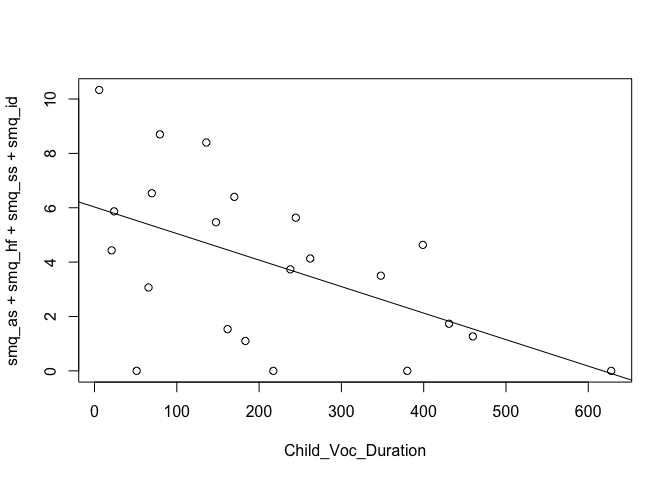

get & prep data

    data <- read.csv('../data/CPP_data_all.csv', header=TRUE)
    smq <- read.csv('../data/SMQ.csv', header=TRUE)
    smq$smq_id <- (18 - smq$smq_id) / 6
    library(plyr)
    data <- ddply(data, .(URSI, SM_dx), summarize,
                  Turn_Count=sum(Turn_Count),
                  Child_Voc_Count=sum(Child_Voc_Count),
                  Child_Voc_Duration=sum(Child_Voc_Duration),
                  Child_NonVoc_Duration=sum(Child_NonVoc_Duration),
                  Average_SignalLevel=mean(Average_SignalLevel),
                  Peak_SignalLevel=max(Peak_SignalLevel)
                  )
    data <- merge(data, smq, by="URSI", all=TRUE)
    remove(smq)
    data$SM_dx <- factor(data$SM_dx)

subset train/test

    set.seed(2)
    train_ind <- sample(seq_len(nrow(data)), size=12)

    train <- data[train_ind, ]
    test <- data[-train_ind, ]

logistical regression predicting SM dx

    overfit.model <- glm(SM_dx ~ Child_Voc_Count+Turn_Count+Child_Voc_Duration+Child_NonVoc_Duration+Average_SignalLevel+Peak_SignalLevel, family=binomial(link='logit'), data=data, na.action=na.pass)

    ## Warning: glm.fit: fitted probabilities numerically 0 or 1 occurred

    summary(overfit.model)

    ## 
    ## Call:
    ## glm(formula = SM_dx ~ Child_Voc_Count + Turn_Count + Child_Voc_Duration + 
    ##     Child_NonVoc_Duration + Average_SignalLevel + Peak_SignalLevel, 
    ##     family = binomial(link = "logit"), data = data, na.action = na.pass)
    ## 
    ## Deviance Residuals: 
    ##      Min        1Q    Median        3Q       Max  
    ## -1.31463  -0.15227  -0.00001   0.00958   1.88559  
    ## 
    ## Coefficients:
    ##                        Estimate Std. Error z value Pr(>|z|)
    ## (Intercept)            27.68975  130.87658   0.212    0.832
    ## Child_Voc_Count        -0.34036    0.27246  -1.249    0.212
    ## Turn_Count              0.08218    0.10353   0.794    0.427
    ## Child_Voc_Duration      0.29761    0.25499   1.167    0.243
    ## Child_NonVoc_Duration   0.01192    0.21905   0.054    0.957
    ## Average_SignalLevel     3.44383    2.42805   1.418    0.156
    ## Peak_SignalLevel       -2.86856    2.63568  -1.088    0.276
    ## 
    ## (Dispersion parameter for binomial family taken to be 1)
    ## 
    ##     Null deviance: 33.271  on 23  degrees of freedom
    ## Residual deviance:  6.929  on 17  degrees of freedom
    ## AIC: 20.929
    ## 
    ## Number of Fisher Scoring iterations: 9

    anova(overfit.model, test="Chisq")

    ## Analysis of Deviance Table
    ## 
    ## Model: binomial, link: logit
    ## 
    ## Response: SM_dx
    ## 
    ## Terms added sequentially (first to last)
    ## 
    ## 
    ##                       Df Deviance Resid. Df Resid. Dev Pr(>Chi)   
    ## NULL                                     23     33.271            
    ## Child_Voc_Count        1   9.0331        22     24.238 0.002651 **
    ## Turn_Count             1   0.0007        21     24.237 0.978189   
    ## Child_Voc_Duration     1   7.5150        20     16.722 0.006119 **
    ## Child_NonVoc_Duration  1   1.8870        19     14.835 0.169544   
    ## Average_SignalLevel    1   5.6737        18      9.162 0.017221 * 
    ## Peak_SignalLevel       1   2.2326        17      6.929 0.135127   
    ## ---
    ## Signif. codes:  0 '***' 0.001 '**' 0.01 '*' 0.05 '.' 0.1 ' ' 1

ROC for logistical regression

    library('ROCR')

    ## Loading required package: gplots

    ## 
    ## Attaching package: 'gplots'

    ## The following object is masked from 'package:stats':
    ## 
    ##     lowess

    overfit.p <- predict(overfit.model, newdata=data, type="response")
    overfit.pr <- prediction(overfit.p, data$SM_dx)
    overfit.prf <- performance(overfit.pr, measure="tpr", x.measure="fpr")
    plot(overfit.prf)

AUC for ROC

    overfit.auc <- performance(overfit.pr, measure="auc")
    overfit.auc <- overfit.auc@y.values[[1]]
    overfit.auc

    ## [1] 0.9861111

logistical regression predicting SM dx

    model <- glm(SM_dx ~ Child_Voc_Count+Turn_Count+Child_Voc_Duration+Child_NonVoc_Duration+Average_SignalLevel+Peak_SignalLevel, family=binomial(link='logit'), data=train, na.action=na.pass)

    ## Warning: glm.fit: fitted probabilities numerically 0 or 1 occurred

    summary(model)

    ## 
    ## Call:
    ## glm(formula = SM_dx ~ Child_Voc_Count + Turn_Count + Child_Voc_Duration + 
    ##     Child_NonVoc_Duration + Average_SignalLevel + Peak_SignalLevel, 
    ##     family = binomial(link = "logit"), data = train, na.action = na.pass)
    ## 
    ## Deviance Residuals: 
    ##          5          17          13           4          19          18  
    ##  2.110e-08  -1.166e-05   8.395e-06   4.426e-06   1.364e-05  -5.201e-06  
    ##          3          15           8           9          16          21  
    ##  4.375e-07  -1.112e-05  -2.110e-08   2.110e-08  -2.110e-08  -2.110e-08  
    ## 
    ## Coefficients:
    ##                         Estimate Std. Error z value Pr(>|z|)
    ## (Intercept)           -9.737e+02  2.299e+07       0        1
    ## Child_Voc_Count       -1.630e+00  5.739e+04       0        1
    ## Turn_Count             4.198e-01  3.277e+04       0        1
    ## Child_Voc_Duration     1.130e+00  6.051e+04       0        1
    ## Child_NonVoc_Duration  2.897e+00  1.564e+05       0        1
    ## Average_SignalLevel    1.914e+01  5.935e+05       0        1
    ## Peak_SignalLevel      -3.290e+00  1.760e+05       0        1
    ## 
    ## (Dispersion parameter for binomial family taken to be 1)
    ## 
    ##     Null deviance: 1.6636e+01  on 11  degrees of freedom
    ## Residual deviance: 5.6295e-10  on  5  degrees of freedom
    ## AIC: 14
    ## 
    ## Number of Fisher Scoring iterations: 24

    anova(model, test="Chisq")

    ## Warning: glm.fit: fitted probabilities numerically 0 or 1 occurred

    ## Warning: glm.fit: fitted probabilities numerically 0 or 1 occurred

    ## Warning: glm.fit: fitted probabilities numerically 0 or 1 occurred

    ## Analysis of Deviance Table
    ## 
    ## Model: binomial, link: logit
    ## 
    ## Response: SM_dx
    ## 
    ## Terms added sequentially (first to last)
    ## 
    ## 
    ##                       Df Deviance Resid. Df Resid. Dev Pr(>Chi)   
    ## NULL                                     11    16.6355            
    ## Child_Voc_Count        1   6.6058        10    10.0297 0.010164 * 
    ## Turn_Count             1   0.8549         9     9.1748 0.355174   
    ## Child_Voc_Duration     1   9.1748         8     0.0000 0.002454 **
    ## Child_NonVoc_Duration  1   0.0000         7     0.0000 0.999991   
    ## Average_SignalLevel    1   0.0000         6     0.0000 0.999991   
    ## Peak_SignalLevel       1   0.0000         5     0.0000 1.000000   
    ## ---
    ## Signif. codes:  0 '***' 0.001 '**' 0.01 '*' 0.05 '.' 0.1 ' ' 1

    p <- predict(model, newdata=test, type="response")
    pr <- prediction(p, test$SM_dx)
    prf <- performance(pr, measure="tpr", x.measure="fpr")
    plot(prf)

    auc <- performance(pr, measure="auc")
    auc <- auc@y.values[[1]]
    auc

    ## [1] 0.8194444

forward logistical regression

    library("MASS")
    fwd.overfit.model <- stepAIC(glm(SM_dx ~ 1, family=binomial(link='logit'), data=data, na.action=na.pass), direction='forward',
                         scope=~Child_Voc_Count+Turn_Count+Child_Voc_Duration+Child_NonVoc_Duration+Average_SignalLevel+Peak_SignalLevel)

    ## Start:  AIC=35.27
    ## SM_dx ~ 1
    ## 
    ##                         Df Deviance    AIC
    ## + Child_Voc_Count        1   24.238 28.238
    ## + Turn_Count             1   25.232 29.232
    ## + Child_Voc_Duration     1   26.216 30.216
    ## + Child_NonVoc_Duration  1   28.549 32.549
    ## <none>                       33.271 35.271
    ## + Peak_SignalLevel       1   32.795 36.795
    ## + Average_SignalLevel    1   32.904 36.904
    ## 
    ## Step:  AIC=28.24
    ## SM_dx ~ Child_Voc_Count
    ## 
    ##                         Df Deviance    AIC
    ## + Child_Voc_Duration     1   17.887 23.887
    ## + Average_SignalLevel    1   18.588 24.588
    ## <none>                       24.238 28.238
    ## + Peak_SignalLevel       1   23.779 29.779
    ## + Child_NonVoc_Duration  1   24.172 30.172
    ## + Turn_Count             1   24.237 30.237
    ## 
    ## Step:  AIC=23.89
    ## SM_dx ~ Child_Voc_Count + Child_Voc_Duration
    ## 
    ##                         Df Deviance    AIC
    ## + Average_SignalLevel    1   9.2246 17.225
    ## + Child_NonVoc_Duration  1  15.7369 23.737
    ## <none>                      17.8870 23.887
    ## + Turn_Count             1  16.7222 24.722
    ## + Peak_SignalLevel       1  17.8614 25.861
    ## 
    ## Step:  AIC=17.22
    ## SM_dx ~ Child_Voc_Count + Child_Voc_Duration + Average_SignalLevel
    ## 
    ##                         Df Deviance    AIC
    ## <none>                       9.2246 17.225
    ## + Peak_SignalLevel       1   7.8506 17.851
    ## + Child_NonVoc_Duration  1   9.1616 19.162
    ## + Turn_Count             1   9.2213 19.221

    fwd.overfit.model$anova

    ## Stepwise Model Path 
    ## Analysis of Deviance Table
    ## 
    ## Initial Model:
    ## SM_dx ~ 1
    ## 
    ## Final Model:
    ## SM_dx ~ Child_Voc_Count + Child_Voc_Duration + Average_SignalLevel
    ## 
    ## 
    ##                    Step Df Deviance Resid. Df Resid. Dev      AIC
    ## 1                                          23  33.271065 35.27106
    ## 2     + Child_Voc_Count  1 9.033119        22  24.237946 28.23795
    ## 3  + Child_Voc_Duration  1 6.350912        21  17.887033 23.88703
    ## 4 + Average_SignalLevel  1 8.662386        20   9.224648 17.22465

ROC, AUC

    fwd.overfit.p <- predict(fwd.overfit.model, newdata=data, type="response")
    fwd.overfit.pr <- prediction(fwd.overfit.p, data$SM_dx)
    fwd.overfit.prf <- performance(fwd.overfit.pr, measure="tpr", x.measure="fpr")
    plot(fwd.overfit.prf)

    fwd.overfit.auc <- performance(fwd.overfit.pr, measure="auc")
    fwd.overfit.auc <- fwd.overfit.auc@y.values[[1]]
    fwd.overfit.auc

    ## [1] 0.9861111

forward logistical regression without overfitting

    fwd.model <- stepAIC(glm(SM_dx ~ 1, family=binomial(link='logit'), data=train, na.action=na.pass), direction='forward', scope=~Child_Voc_Count+Turn_Count+Child_Voc_Duration+Child_NonVoc_Duration+Average_SignalLevel+Peak_SignalLevel)

    ## Start:  AIC=18.64
    ## SM_dx ~ 1
    ## 
    ##                         Df Deviance    AIC
    ## + Child_Voc_Count        1   10.030 14.030
    ## + Child_Voc_Duration     1   11.172 15.172
    ## + Turn_Count             1   12.617 16.617
    ## + Child_NonVoc_Duration  1   12.803 16.803
    ## <none>                       16.636 18.636
    ## + Peak_SignalLevel       1   15.357 19.357
    ## + Average_SignalLevel    1   16.199 20.199
    ## 
    ## Step:  AIC=14.03
    ## SM_dx ~ Child_Voc_Count

    ## Warning: glm.fit: fitted probabilities numerically 0 or 1 occurred

    ##                         Df Deviance    AIC
    ## + Average_SignalLevel    1   0.0000  6.000
    ## + Child_Voc_Duration     1   6.5581 12.558
    ## + Peak_SignalLevel       1   7.8576 13.858
    ## <none>                      10.0297 14.030
    ## + Turn_Count             1   9.1748 15.175
    ## + Child_NonVoc_Duration  1   9.4278 15.428

    ## Warning: glm.fit: fitted probabilities numerically 0 or 1 occurred

    ## 
    ## Step:  AIC=6
    ## SM_dx ~ Child_Voc_Count + Average_SignalLevel

    ## Warning: glm.fit: fitted probabilities numerically 0 or 1 occurred

    ## Warning: glm.fit: fitted probabilities numerically 0 or 1 occurred

    ## Warning: glm.fit: fitted probabilities numerically 0 or 1 occurred

    ## Warning: glm.fit: fitted probabilities numerically 0 or 1 occurred

    ## Warning: glm.fit: fitted probabilities numerically 0 or 1 occurred

    ##                         Df   Deviance AIC
    ## <none>                     3.9650e-10   6
    ## + Child_Voc_Duration     1 2.4017e-10   8
    ## + Peak_SignalLevel       1 2.9990e-10   8
    ## + Child_NonVoc_Duration  1 3.5604e-10   8
    ## + Turn_Count             1 3.8443e-10   8

    fwd.model$anova

    ## Stepwise Model Path 
    ## Analysis of Deviance Table
    ## 
    ## Initial Model:
    ## SM_dx ~ 1
    ## 
    ## Final Model:
    ## SM_dx ~ Child_Voc_Count + Average_SignalLevel
    ## 
    ## 
    ##                    Step Df  Deviance Resid. Df   Resid. Dev      AIC
    ## 1                                           11 1.663553e+01 18.63553
    ## 2     + Child_Voc_Count  1  6.605843        10 1.002969e+01 14.02969
    ## 3 + Average_SignalLevel  1 10.029689         9 3.964957e-10  6.00000

ROC, AUC

    fwd.p <- predict(fwd.model, newdata=test, type="response")
    fwd.pr <- prediction(fwd.p, test$SM_dx)
    fwd.prf <- performance(fwd.pr, measure="tpr", x.measure="fpr")
    plot(fwd.prf)

    fwd.auc <- performance(fwd.pr, measure="auc")
    fwd.auc <- fwd.auc@y.values[[1]]
    fwd.auc

    ## [1] 0.8333333

forward regression for SMQ

    fwd.overfit.smq.model <- step(lm(smq_as+smq_hf+smq_ss+smq_id ~ 1, data=data[complete.cases(data),], na.action=na.omit), direction='forward', scope=~Child_Voc_Count+Turn_Count+Child_Voc_Duration+Child_NonVoc_Duration+Average_SignalLevel+Peak_SignalLevel)

    ## Start:  AIC=49.98
    ## smq_as + smq_hf + smq_ss + smq_id ~ 1
    ## 
    ##                         Df Sum of Sq    RSS    AIC
    ## + Child_Voc_Count        1    65.406 129.43 42.986
    ## + Turn_Count             1    62.929 131.91 43.403
    ## + Child_Voc_Duration     1    55.569 139.27 44.598
    ## + Child_NonVoc_Duration  1    28.902 165.94 48.452
    ## <none>                               194.84 49.985
    ## + Average_SignalLevel    1     7.606 187.23 51.109
    ## + Peak_SignalLevel       1     2.689 192.15 51.679
    ## 
    ## Step:  AIC=42.99
    ## smq_as + smq_hf + smq_ss + smq_id ~ Child_Voc_Count
    ## 
    ##                         Df Sum of Sq    RSS    AIC
    ## + Child_Voc_Duration     1   18.6022 110.83 41.573
    ## <none>                               129.43 42.986
    ## + Average_SignalLevel    1    9.1278 120.30 43.378
    ## + Peak_SignalLevel       1    4.3794 125.05 44.229
    ## + Turn_Count             1    1.1685 128.26 44.787
    ## + Child_NonVoc_Duration  1    0.0000 129.43 44.986
    ## 
    ## Step:  AIC=41.57
    ## smq_as + smq_hf + smq_ss + smq_id ~ Child_Voc_Count + Child_Voc_Duration
    ## 
    ##                         Df Sum of Sq    RSS    AIC
    ## <none>                               110.83 41.573
    ## + Average_SignalLevel    1    8.9200 101.91 41.727
    ## + Child_NonVoc_Duration  1    2.6187 108.21 43.047
    ## + Peak_SignalLevel       1    1.2385 109.59 43.326
    ## + Turn_Count             1    0.3488 110.48 43.504

    fwd.overfit.smq.model$anova

    ##                   Step Df Deviance Resid. Df Resid. Dev      AIC
    ## 1                      NA       NA        21   194.8376 49.98472
    ## 2    + Child_Voc_Count -1 65.40560        20   129.4320 42.98649
    ## 3 + Child_Voc_Duration -1 18.60218        19   110.8298 41.57297

    summary(fwd.overfit.smq.model)

    ## 
    ## Call:
    ## lm(formula = smq_as + smq_hf + smq_ss + smq_id ~ Child_Voc_Count + 
    ##     Child_Voc_Duration, data = data[complete.cases(data), ], 
    ##     na.action = na.omit)
    ## 
    ## Residuals:
    ##     Min      1Q  Median      3Q     Max 
    ## -3.5451 -1.8877  0.1258  1.4153  5.4717 
    ## 
    ## Coefficients:
    ##                    Estimate Std. Error t value Pr(>|t|)    
    ## (Intercept)         5.05397    0.94859   5.328 3.84e-05 ***
    ## Child_Voc_Count     0.04496    0.02036   2.208   0.0397 *  
    ## Child_Voc_Duration -0.04324    0.02422  -1.786   0.0901 .  
    ## ---
    ## Signif. codes:  0 '***' 0.001 '**' 0.01 '*' 0.05 '.' 0.1 ' ' 1
    ## 
    ## Residual standard error: 2.415 on 19 degrees of freedom
    ## Multiple R-squared:  0.4312, Adjusted R-squared:  0.3713 
    ## F-statistic: 7.201 on 2 and 19 DF,  p-value: 0.004703

partial regression plot

    library("car")
    av.plots(fwd.overfit.smq.model)

    ## Warning: 'av.plots' is deprecated.
    ## Use 'avPlots' instead.
    ## See help("Deprecated") and help("car-deprecated").

    plot(smq_as+smq_hf+smq_ss+smq_id ~ Child_Voc_Count, data=data[complete.cases(data),])
    abline(lm(smq_as+smq_hf+smq_ss+smq_id ~ Child_Voc_Count, data=data[complete.cases(data),]))

    plot(smq_as+smq_hf+smq_ss+smq_id ~ Child_Voc_Duration, data=data[complete.cases(data),])
    abline(lm(smq_as+smq_hf+smq_ss+smq_id ~ Child_Voc_Duration, data=data[complete.cases(data),]))

    plot(smq_as+smq_hf+smq_ss+smq_id ~ Average_SignalLevel, data=data[complete.cases(data),])
    abline(lm(smq_as+smq_hf+smq_ss+smq_id ~ Average_SignalLevel, data=data[complete.cases(data),]))

